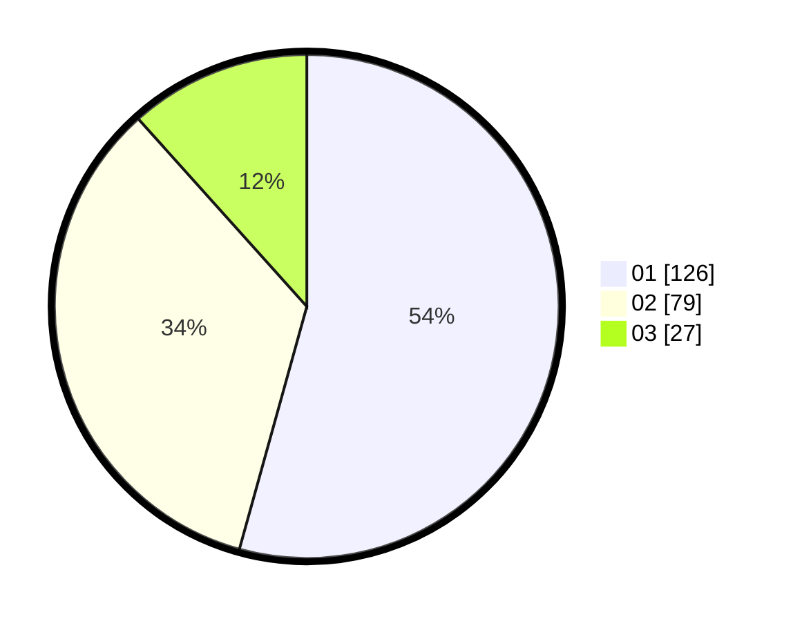

# Hasil

Hasil perolehan suara paslon dapat dilihat pada file paslon-01.txt, paslon-02.txt, dan paslon-03.txt.

Jika tidak ada, artinya data tersebut belum ada pada SIREKAP.

## Perolehan Suara

 * Paslon 01: **126**.
 * Paslon 02: **79**.
 * Paslon 03: **27**.

## Foto C Plano

https://sirekap-obj-formc.kpu.go.id/c741/pemilu/ppwp/31/75/02/10/04/3175021004079-20240216-064450--562744eb-d91a-4829-a52f-ec70c4f48c84.jpg

https://sirekap-obj-formc.kpu.go.id/c741/pemilu/ppwp/31/75/02/10/04/3175021004079-20240216-105431--451df174-fd07-4252-9840-12279d63850a.jpg

https://sirekap-obj-formc.kpu.go.id/c741/pemilu/ppwp/31/75/02/10/04/3175021004079-20240216-064455--c4cfec1b-79cf-4b85-b3e1-a6cea5d3f302.jpg

## DATA PEMILIH TETAP

Jumlah pemilih dalam DPT: **264**.
 * L: **139**.
 * P: **125**.

## DATA PENGGUNA HAK PILIH

Jumlah pengguna hak pilih dalam DPT: **238**.
 * L: **121**.
 * P: **117**.

Jumlah pengguna hak pilih dalam DPTb: **1**.
 * L: **0**.
 * P: **1**.

Jumlah pengguna hak pilih dalam DPK: **1**.
 * L: **0**.
 * P: **1**.

Jumlah pengguna hak pilih: **240**.
 * L: **121**.
 * P: **119**.

## JUMLAH SUARA SAH DAN TIDAK SAH

JUMLAH SELURUH SUARA SAH: **232**.

JUMLAH SUARA TIDAK SAH: **8**.

JUMLAH SELURUH SUARA SAH DAN SUARA TIDAK SAH: **240**.
