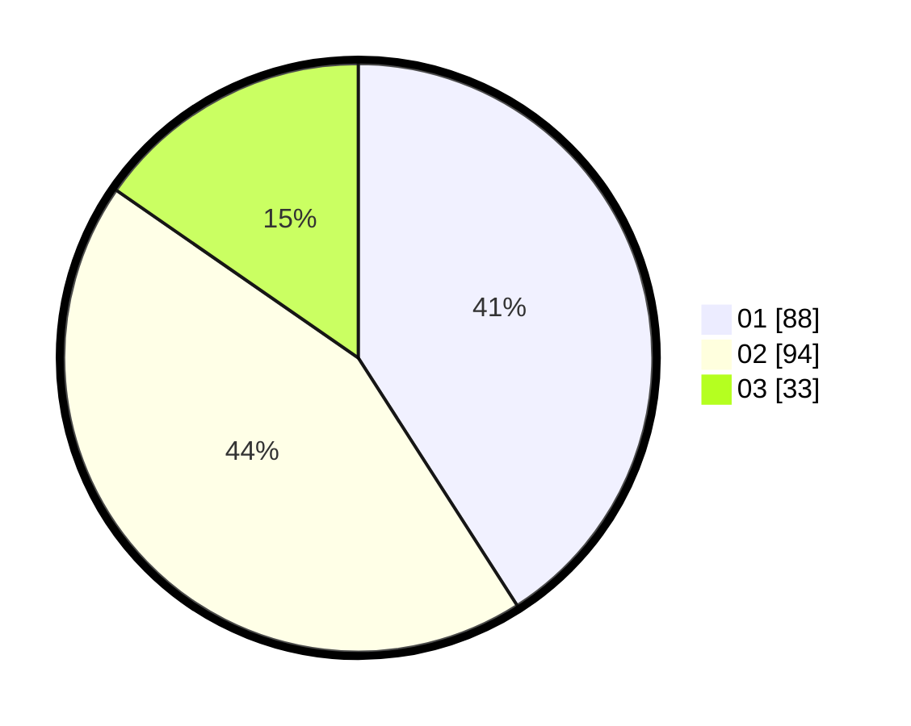

# Hasil

Hasil perolehan suara paslon dapat dilihat pada file paslon-01.txt, paslon-02.txt, dan paslon-03.txt.

Jika tidak ada, artinya data tersebut belum ada pada SIREKAP.

## Perolehan Suara

 * Paslon 01: **88**.
 * Paslon 02: **94**.
 * Paslon 03: **33**.

## Foto C Plano

https://sirekap-obj-formc.kpu.go.id/58f9/pemilu/ppwp/31/75/02/10/05/3175021005008-20240214-205611--6c60e0cf-fb21-45f5-abeb-a903c8fa02e2.jpg

https://sirekap-obj-formc.kpu.go.id/58f9/pemilu/ppwp/31/75/02/10/05/3175021005008-20240214-205907--8d81c2a7-655e-4c01-9106-8a014d6d7a50.jpg

https://sirekap-obj-formc.kpu.go.id/58f9/pemilu/ppwp/31/75/02/10/05/3175021005008-20240214-205743--5e815827-d570-4191-9587-b6f2d7272775.jpg

## DATA PEMILIH TETAP

Jumlah pemilih dalam DPT: **263**.
 * L: **133**.
 * P: **130**.

## DATA PENGGUNA HAK PILIH

Jumlah pengguna hak pilih dalam DPT: **207**.
 * L: **98**.
 * P: **109**.

Jumlah pengguna hak pilih dalam DPTb: **4**.
 * L: **0**.
 * P: **4**.

Jumlah pengguna hak pilih dalam DPK: **4**.
 * L: **3**.
 * P: **1**.

Jumlah pengguna hak pilih: **215**.
 * L: **101**.
 * P: **114**.

## JUMLAH SUARA SAH DAN TIDAK SAH

JUMLAH SELURUH SUARA SAH: **215**.

JUMLAH SUARA TIDAK SAH: **0**.

JUMLAH SELURUH SUARA SAH DAN SUARA TIDAK SAH: **215**.
