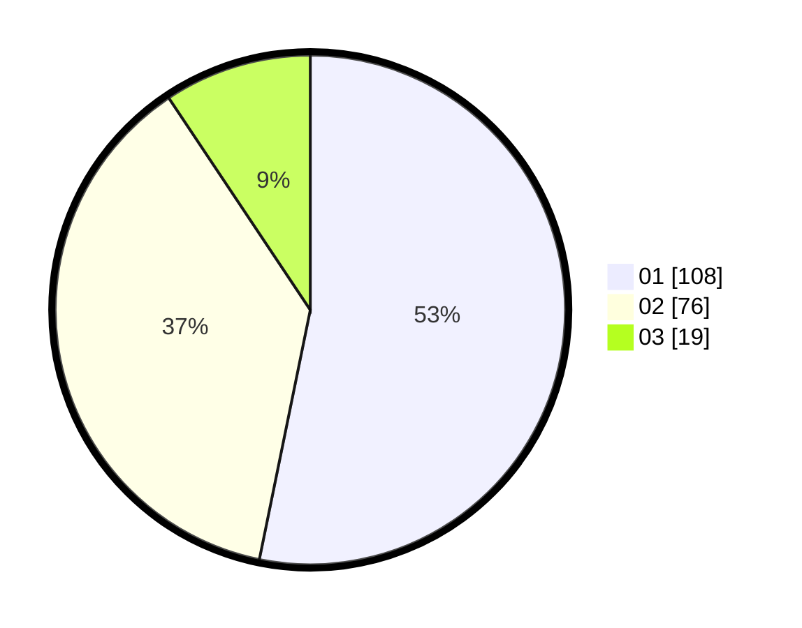

# Hasil

Hasil perolehan suara paslon dapat dilihat pada file paslon-01.txt, paslon-02.txt, dan paslon-03.txt.

Jika tidak ada, artinya data tersebut belum ada pada SIREKAP.

## Perolehan Suara

 * Paslon 01: **108**.
 * Paslon 02: **76**.
 * Paslon 03: **19**.

## Foto C Plano

https://sirekap-obj-formc.kpu.go.id/4b12/pemilu/ppwp/31/75/02/10/05/3175021005009-20240216-062359--ac3a0874-48e9-4b32-949d-9553d65a1588.jpg

https://sirekap-obj-formc.kpu.go.id/4b12/pemilu/ppwp/31/75/02/10/05/3175021005009-20240216-062403--7440a18e-4e47-4be7-8770-de35a8021aa6.jpg

https://sirekap-obj-formc.kpu.go.id/4b12/pemilu/ppwp/31/75/02/10/05/3175021005009-20240216-062400--08c15b79-f65c-4c2b-b0e9-f747a7786a4f.jpg

## DATA PEMILIH TETAP

Jumlah pemilih dalam DPT: **261**.
 * L: **124**.
 * P: **137**.

## DATA PENGGUNA HAK PILIH

Jumlah pengguna hak pilih dalam DPT: **200**.
 * L: **88**.
 * P: **112**.

Jumlah pengguna hak pilih dalam DPTb: **7**.
 * L: **6**.
 * P: **1**.

Jumlah pengguna hak pilih dalam DPK: **1**.
 * L: **1**.
 * P: **0**.

Jumlah pengguna hak pilih: **208**.
 * L: **95**.
 * P: **113**.

## JUMLAH SUARA SAH DAN TIDAK SAH

JUMLAH SELURUH SUARA SAH: **203**.

JUMLAH SUARA TIDAK SAH: **5**.

JUMLAH SELURUH SUARA SAH DAN SUARA TIDAK SAH: **208**.
