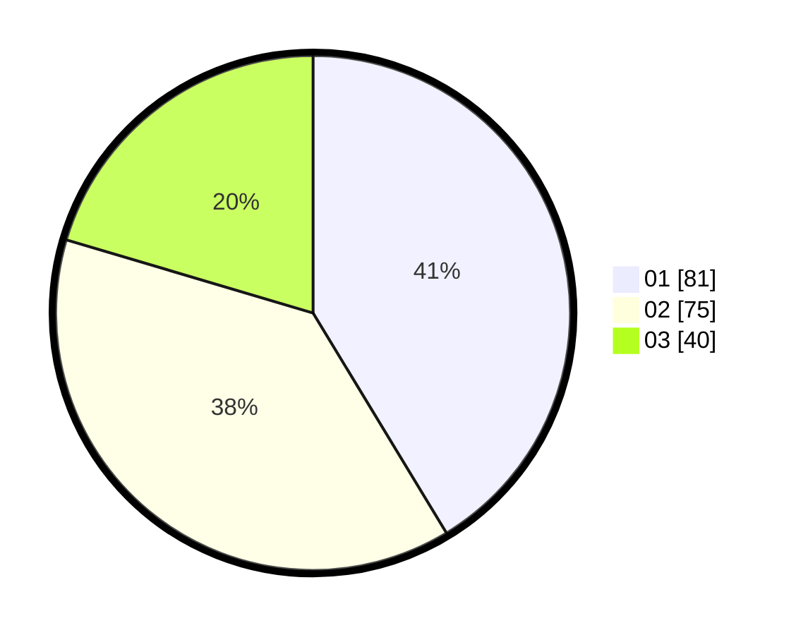

# Hasil

Hasil perolehan suara paslon dapat dilihat pada file paslon-01.txt, paslon-02.txt, dan paslon-03.txt.

Jika tidak ada, artinya data tersebut belum ada pada SIREKAP.

## Perolehan Suara

 * Paslon 01: **81**.
 * Paslon 02: **75**.
 * Paslon 03: **40**.

## Foto C Plano

https://sirekap-obj-formc.kpu.go.id/1252/pemilu/ppwp/31/75/02/10/05/3175021005013-20240216-000445--34d7c481-647c-46f7-a5c0-b4ace7cdfdff.jpg

https://sirekap-obj-formc.kpu.go.id/1252/pemilu/ppwp/31/75/02/10/05/3175021005013-20240216-000449--a4d7c688-5172-4755-b571-0697f8f89d41.jpg

https://sirekap-obj-formc.kpu.go.id/1252/pemilu/ppwp/31/75/02/10/05/3175021005013-20240216-000446--19249f56-b56b-46ff-a23c-2e97db60b7e6.jpg

## DATA PEMILIH TETAP

Jumlah pemilih dalam DPT: **273**.
 * L: **139**.
 * P: **134**.

## DATA PENGGUNA HAK PILIH

Jumlah pengguna hak pilih dalam DPT: **195**.
 * L: **95**.
 * P: **100**.

Jumlah pengguna hak pilih dalam DPTb: **0**.
 * L: **0**.
 * P: **0**.

Jumlah pengguna hak pilih dalam DPK: **3**.
 * L: **3**.
 * P: **0**.

Jumlah pengguna hak pilih: **198**.
 * L: **98**.
 * P: **100**.

## JUMLAH SUARA SAH DAN TIDAK SAH

JUMLAH SELURUH SUARA SAH: **196**.

JUMLAH SUARA TIDAK SAH: **2**.

JUMLAH SELURUH SUARA SAH DAN SUARA TIDAK SAH: **198**.
