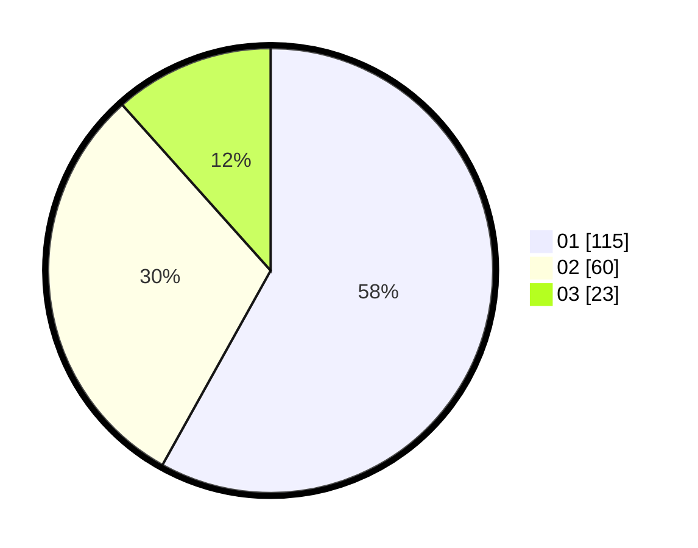

# Hasil

Hasil perolehan suara paslon dapat dilihat pada file paslon-01.txt, paslon-02.txt, dan paslon-03.txt.

Jika tidak ada, artinya data tersebut belum ada pada SIREKAP.

## Perolehan Suara

 * Paslon 01: **115**.
 * Paslon 02: **60**.
 * Paslon 03: **23**.

## Foto C Plano

https://sirekap-obj-formc.kpu.go.id/5da6/pemilu/ppwp/31/75/02/10/05/3175021005015-20240214-233941--f9228e3c-f608-42a3-9904-1b37c9fa5c57.jpg

https://sirekap-obj-formc.kpu.go.id/5da6/pemilu/ppwp/31/75/02/10/05/3175021005015-20240214-234155--656d0f06-cd67-4a03-b1c2-5a4aa9b736b7.jpg

https://sirekap-obj-formc.kpu.go.id/5da6/pemilu/ppwp/31/75/02/10/05/3175021005015-20240215-015325--8fca4dd9-bdb8-4b2f-91d2-dc98589d6e0f.jpg
