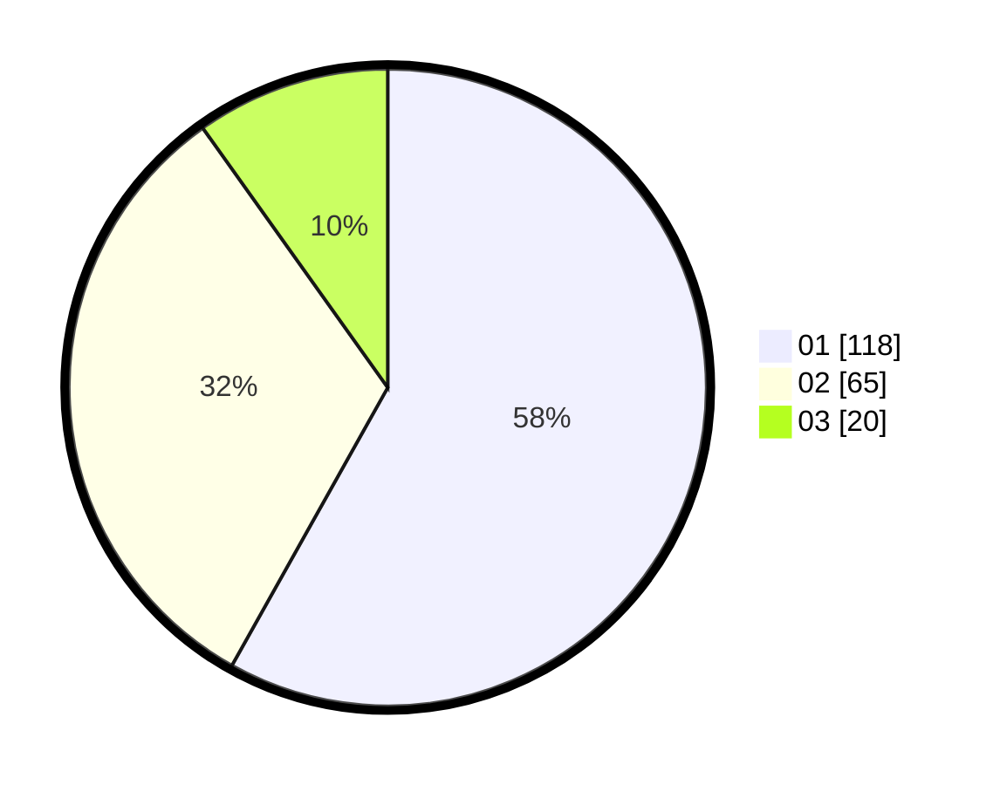

# Hasil

Hasil perolehan suara paslon dapat dilihat pada file paslon-01.txt, paslon-02.txt, dan paslon-03.txt.

Jika tidak ada, artinya data tersebut belum ada pada SIREKAP.

## Perolehan Suara

 * Paslon 01: **118**.
 * Paslon 02: **65**.
 * Paslon 03: **20**.

## Foto C Plano

https://sirekap-obj-formc.kpu.go.id/d963/pemilu/ppwp/31/75/02/10/05/3175021005023-20240215-003636--d586dde9-87eb-4ca7-a298-16a34054ef2a.jpg

https://sirekap-obj-formc.kpu.go.id/d963/pemilu/ppwp/31/75/02/10/05/3175021005023-20240215-003751--e731da25-a693-43fb-b77f-ffb31b7a6647.jpg

https://sirekap-obj-formc.kpu.go.id/d963/pemilu/ppwp/31/75/02/10/05/3175021005023-20240215-003837--1e061090-a430-4199-b869-26f64a894495.jpg
