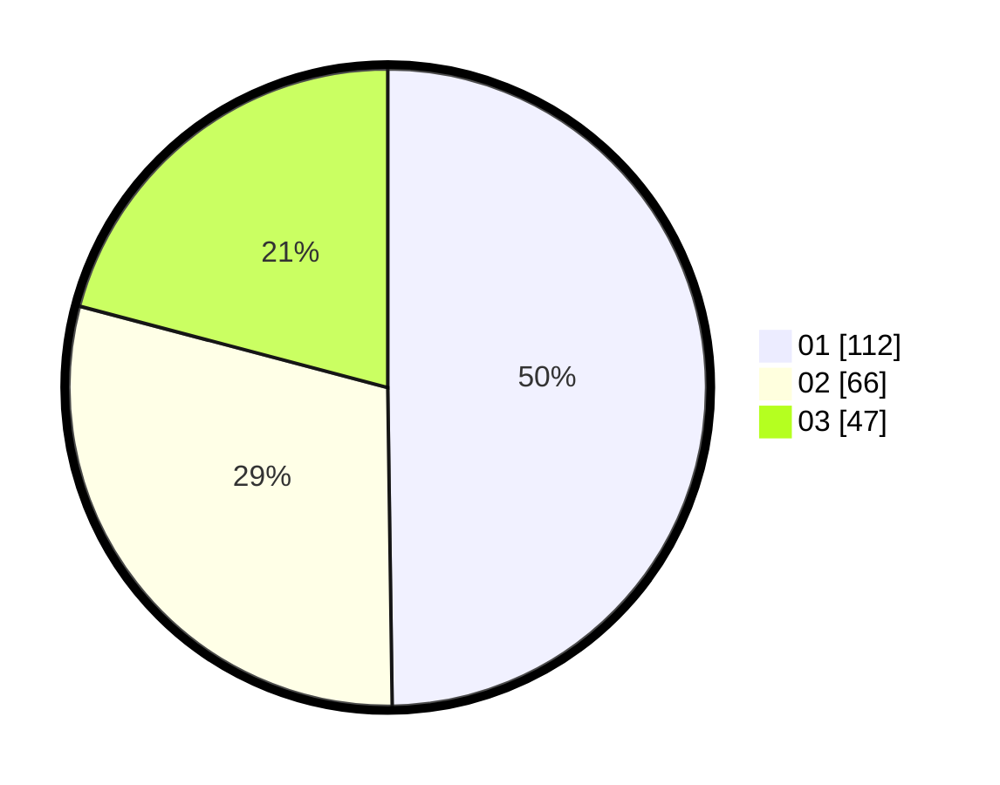

# Hasil

Hasil perolehan suara paslon dapat dilihat pada file paslon-01.txt, paslon-02.txt, dan paslon-03.txt.

Jika tidak ada, artinya data tersebut belum ada pada SIREKAP.

## Perolehan Suara

 * Paslon 01: **112**.
 * Paslon 02: **66**.
 * Paslon 03: **47**.

## Foto C Plano

https://sirekap-obj-formc.kpu.go.id/0e4c/pemilu/ppwp/31/75/02/10/05/3175021005025-20240215-022924--17bf3569-8f11-4853-8411-eda9fafede21.jpg

https://sirekap-obj-formc.kpu.go.id/0e4c/pemilu/ppwp/31/75/02/10/05/3175021005025-20240215-023229--5128d5c1-2a3c-43e8-9abc-7483b026c30f.jpg

https://sirekap-obj-formc.kpu.go.id/0e4c/pemilu/ppwp/31/75/02/10/05/3175021005025-20240215-023405--b2feda83-262b-4f91-9cfe-6ccdbc7fb7dd.jpg
