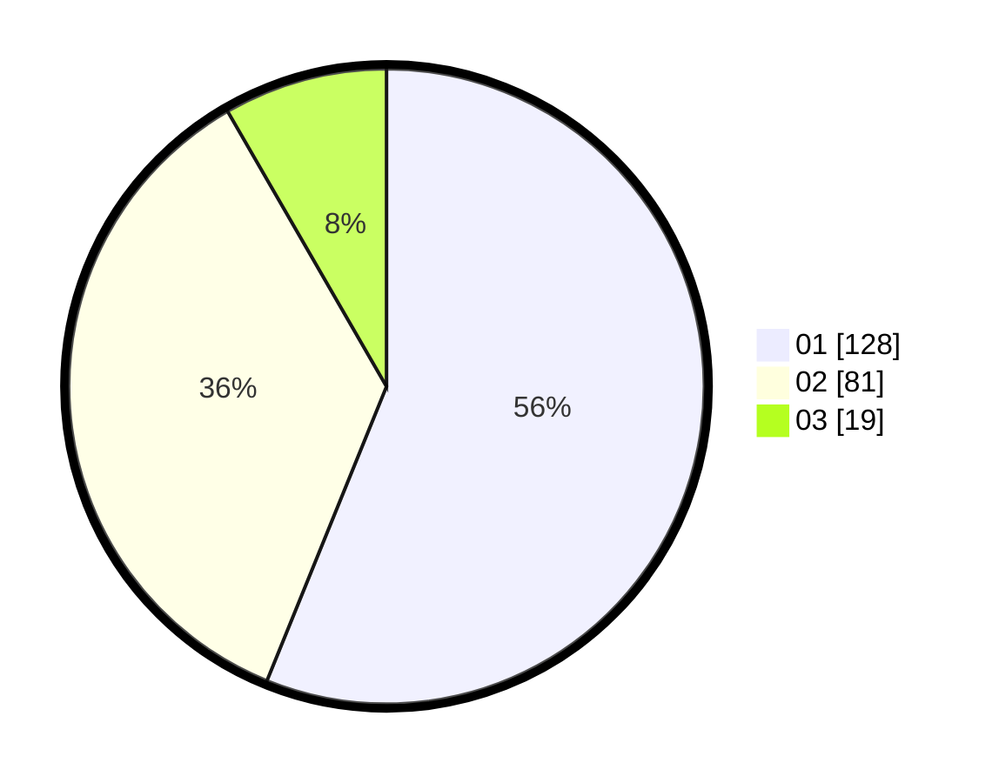

# Hasil

Hasil perolehan suara paslon dapat dilihat pada file paslon-01.txt, paslon-02.txt, dan paslon-03.txt.

Jika tidak ada, artinya data tersebut belum ada pada SIREKAP.

## Perolehan Suara

 * Paslon 01: **128**.
 * Paslon 02: **81**.
 * Paslon 03: **19**.

## Foto C Plano

https://sirekap-obj-formc.kpu.go.id/4e1a/pemilu/ppwp/31/75/02/10/05/3175021005029-20240216-003227--3fc88b4c-e7a6-41e0-8401-ed2c47e17fa6.jpg

https://sirekap-obj-formc.kpu.go.id/4e1a/pemilu/ppwp/31/75/02/10/05/3175021005029-20240216-003234--4ded3978-ec0d-43a5-bc99-bc32530a57ff.jpg

https://sirekap-obj-formc.kpu.go.id/4e1a/pemilu/ppwp/31/75/02/10/05/3175021005029-20240216-003229--74e8caee-0302-44b0-ab6f-e93585d27312.jpg

## DATA PEMILIH TETAP

Jumlah pemilih dalam DPT: **278**.
 * L: **144**.
 * P: **134**.

## DATA PENGGUNA HAK PILIH

Jumlah pengguna hak pilih dalam DPT: **224**.
 * L: **115**.
 * P: **109**.

Jumlah pengguna hak pilih dalam DPTb: **3**.
 * L: **1**.
 * P: **2**.

Jumlah pengguna hak pilih dalam DPK: **1**.
 * L: **1**.
 * P: **0**.

Jumlah pengguna hak pilih: **228**.
 * L: **117**.
 * P: **111**.

## JUMLAH SUARA SAH DAN TIDAK SAH

JUMLAH SELURUH SUARA SAH: **228**.

JUMLAH SUARA TIDAK SAH: **0**.

JUMLAH SELURUH SUARA SAH DAN SUARA TIDAK SAH: **228**.
