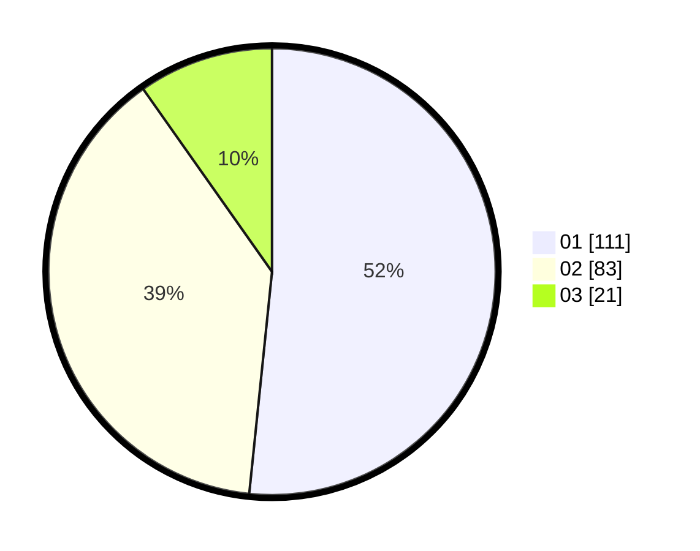

# Hasil

Hasil perolehan suara paslon dapat dilihat pada file paslon-01.txt, paslon-02.txt, dan paslon-03.txt.

Jika tidak ada, artinya data tersebut belum ada pada SIREKAP.

## Perolehan Suara

 * Paslon 01: **111**.
 * Paslon 02: **83**.
 * Paslon 03: **21**.

## Foto C Plano

https://sirekap-obj-formc.kpu.go.id/3f1d/pemilu/ppwp/31/75/02/10/05/3175021005034-20240214-191622--912276d2-0dfc-4a53-ba8e-f5601815991f.jpg

https://sirekap-obj-formc.kpu.go.id/3f1d/pemilu/ppwp/31/75/02/10/05/3175021005034-20240214-192119--3bfeac0b-618e-46b7-900d-2377660a44d0.jpg

https://sirekap-obj-formc.kpu.go.id/3f1d/pemilu/ppwp/31/75/02/10/05/3175021005034-20240214-191754--2699dd33-2e34-44ed-847e-e3ffcc22b1c9.jpg

## DATA PEMILIH TETAP

Jumlah pemilih dalam DPT: **281**.
 * L: **135**.
 * P: **146**.

## DATA PENGGUNA HAK PILIH

Jumlah pengguna hak pilih dalam DPT: **215**.
 * L: **96**.
 * P: **119**.

Jumlah pengguna hak pilih dalam DPTb: **0**.
 * L: **0**.
 * P: **0**.

Jumlah pengguna hak pilih dalam DPK: **0**.
 * L: **0**.
 * P: **0**.

Jumlah pengguna hak pilih: **215**.
 * L: **96**.
 * P: **119**.

## JUMLAH SUARA SAH DAN TIDAK SAH

JUMLAH SELURUH SUARA SAH: **215**.

JUMLAH SUARA TIDAK SAH: **0**.

JUMLAH SELURUH SUARA SAH DAN SUARA TIDAK SAH: **215**.
