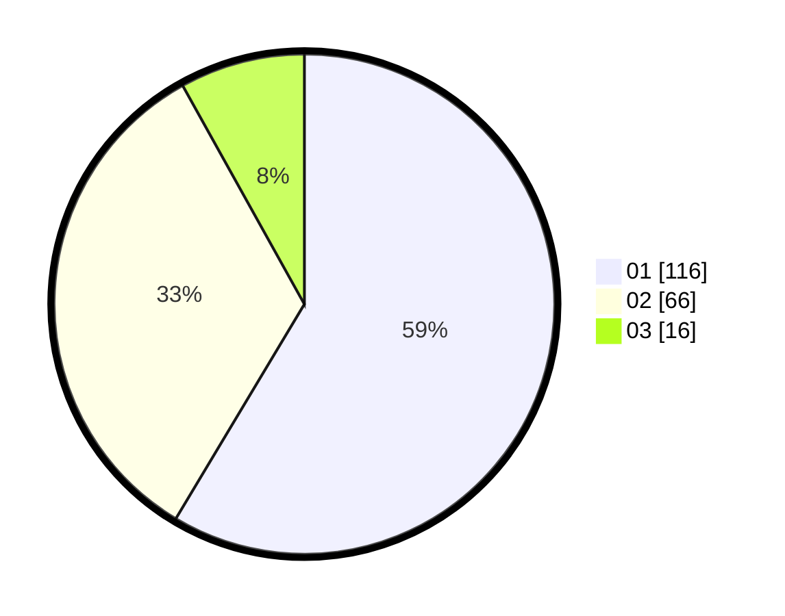

# Hasil

Hasil perolehan suara paslon dapat dilihat pada file paslon-01.txt, paslon-02.txt, dan paslon-03.txt.

Jika tidak ada, artinya data tersebut belum ada pada SIREKAP.

## Perolehan Suara

 * Paslon 01: **116**.
 * Paslon 02: **66**.
 * Paslon 03: **16**.

## Foto C Plano

https://sirekap-obj-formc.kpu.go.id/6e79/pemilu/ppwp/31/75/02/10/05/3175021005036-20240216-021439--a9a2f801-d67f-466c-844b-71af9bca3cc9.jpg

https://sirekap-obj-formc.kpu.go.id/6e79/pemilu/ppwp/31/75/02/10/05/3175021005036-20240216-021441--ae7415fa-0aea-4dfb-8e84-36b59a7c6517.jpg

https://sirekap-obj-formc.kpu.go.id/6e79/pemilu/ppwp/31/75/02/10/05/3175021005036-20240216-021440--34464b69-c24c-4387-afe3-c95d6e963cdc.jpg

## DATA PEMILIH TETAP

Jumlah pemilih dalam DPT: **264**.
 * L: **129**.
 * P: **135**.

## DATA PENGGUNA HAK PILIH

Jumlah pengguna hak pilih dalam DPT: **190**.
 * L: **94**.
 * P: **96**.

Jumlah pengguna hak pilih dalam DPTb: **4**.
 * L: **0**.
 * P: **4**.

Jumlah pengguna hak pilih dalam DPK: **6**.
 * L: **2**.
 * P: **4**.

Jumlah pengguna hak pilih: **200**.
 * L: **96**.
 * P: **104**.

## JUMLAH SUARA SAH DAN TIDAK SAH

JUMLAH SELURUH SUARA SAH: **198**.

JUMLAH SUARA TIDAK SAH: **2**.

JUMLAH SELURUH SUARA SAH DAN SUARA TIDAK SAH: **200**.
