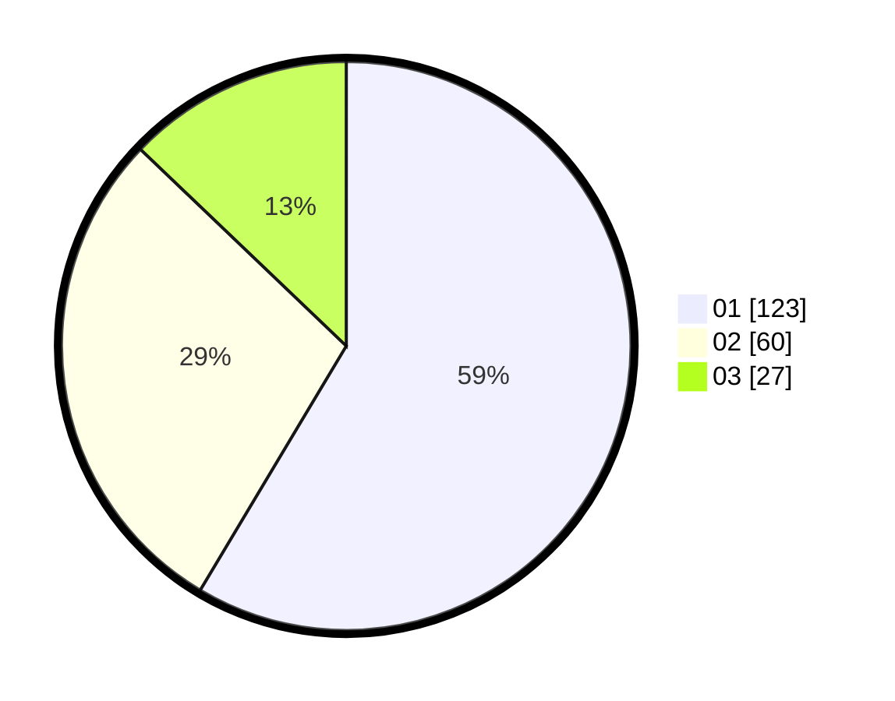

# Hasil

Hasil perolehan suara paslon dapat dilihat pada file paslon-01.txt, paslon-02.txt, dan paslon-03.txt.

Jika tidak ada, artinya data tersebut belum ada pada SIREKAP.

## Perolehan Suara

 * Paslon 01: **123**.
 * Paslon 02: **60**.
 * Paslon 03: **27**.

## Foto C Plano

https://sirekap-obj-formc.kpu.go.id/ef89/pemilu/ppwp/31/75/02/10/05/3175021005037-20240214-185614--0d3d3c9b-ddc3-4303-af2c-6e3e52f8bc8d.jpg

https://sirekap-obj-formc.kpu.go.id/ef89/pemilu/ppwp/31/75/02/10/05/3175021005037-20240214-185725--613f4662-4b7c-45d7-9466-84b401b231c6.jpg

https://sirekap-obj-formc.kpu.go.id/ef89/pemilu/ppwp/31/75/02/10/05/3175021005037-20240214-185820--c18409f5-c137-4af6-9fa8-f02bffb50b4e.jpg

## DATA PEMILIH TETAP

Jumlah pemilih dalam DPT: **280**.
 * L: **131**.
 * P: **149**.

## DATA PENGGUNA HAK PILIH

Jumlah pengguna hak pilih dalam DPT: **212**.
 * L: **93**.
 * P: **118**.

Jumlah pengguna hak pilih dalam DPTb: **0**.
 * L: **0**.
 * P: **0**.

Jumlah pengguna hak pilih dalam DPK: **1**.
 * L: **1**.
 * P: **0**.

Jumlah pengguna hak pilih: **212**.
 * L: **94**.
 * P: **118**.

## JUMLAH SUARA SAH DAN TIDAK SAH

JUMLAH SELURUH SUARA SAH: **210**.

JUMLAH SUARA TIDAK SAH: **2**.

JUMLAH SELURUH SUARA SAH DAN SUARA TIDAK SAH: **212**.
