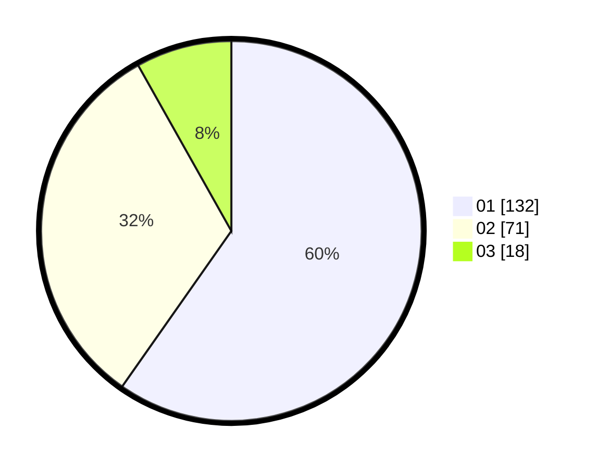

# Hasil

Hasil perolehan suara paslon dapat dilihat pada file paslon-01.txt, paslon-02.txt, dan paslon-03.txt.

Jika tidak ada, artinya data tersebut belum ada pada SIREKAP.

## Perolehan Suara

 * Paslon 01: **132**.
 * Paslon 02: **71**.
 * Paslon 03: **18**.

## Foto C Plano

https://sirekap-obj-formc.kpu.go.id/3f52/pemilu/ppwp/31/75/02/10/05/3175021005038-20240214-185333--e1334b56-a70e-4458-b1cb-82d38a32abd3.jpg

https://sirekap-obj-formc.kpu.go.id/3f52/pemilu/ppwp/31/75/02/10/05/3175021005038-20240214-190009--daf762f8-8d08-4097-a9f0-8f31accf64f7.jpg

https://sirekap-obj-formc.kpu.go.id/3f52/pemilu/ppwp/31/75/02/10/05/3175021005038-20240214-190622--dc3ebf86-9d0f-469a-8dee-0974e8b0a111.jpg

## DATA PEMILIH TETAP

Jumlah pemilih dalam DPT: **264**.
 * L: **129**.
 * P: **135**.

## DATA PENGGUNA HAK PILIH

Jumlah pengguna hak pilih dalam DPT: **209**.
 * L: **105**.
 * P: **104**.

Jumlah pengguna hak pilih dalam DPTb: **16**.
 * L: **9**.
 * P: **7**.

Jumlah pengguna hak pilih dalam DPK: **1**.
 * L: **0**.
 * P: **1**.

Jumlah pengguna hak pilih: **226**.
 * L: **114**.
 * P: **112**.

## JUMLAH SUARA SAH DAN TIDAK SAH

JUMLAH SELURUH SUARA SAH: **221**.

JUMLAH SUARA TIDAK SAH: **5**.

JUMLAH SELURUH SUARA SAH DAN SUARA TIDAK SAH: **226**.
