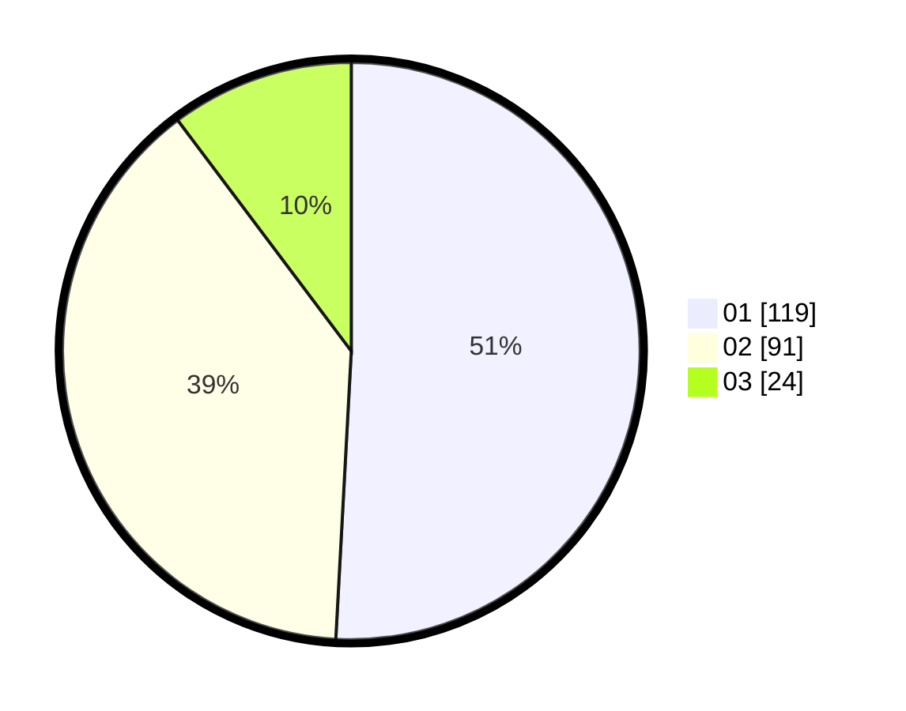

# Hasil

Hasil perolehan suara paslon dapat dilihat pada file paslon-01.txt, paslon-02.txt, dan paslon-03.txt.

Jika tidak ada, artinya data tersebut belum ada pada SIREKAP.

## Perolehan Suara

 * Paslon 01: **119**.
 * Paslon 02: **91**.
 * Paslon 03: **24**.

## Foto C Plano

https://sirekap-obj-formc.kpu.go.id/76f6/pemilu/ppwp/31/75/02/10/05/3175021005045-20240214-155723--8bf187aa-b97f-410e-9965-feb895169524.jpg

https://sirekap-obj-formc.kpu.go.id/76f6/pemilu/ppwp/31/75/02/10/05/3175021005045-20240214-194316--1d826f20-f071-4b44-9ac0-01be937be128.jpg

https://sirekap-obj-formc.kpu.go.id/76f6/pemilu/ppwp/31/75/02/10/05/3175021005045-20240214-160137--9491982b-9e8e-4a51-a3b1-effc778ce362.jpg

## DATA PEMILIH TETAP

Jumlah pemilih dalam DPT: **289**.
 * L: **144**.
 * P: **145**.

## DATA PENGGUNA HAK PILIH

Jumlah pengguna hak pilih dalam DPT: **227**.
 * L: **108**.
 * P: **119**.

Jumlah pengguna hak pilih dalam DPTb: **8**.
 * L: **4**.
 * P: **4**.

Jumlah pengguna hak pilih dalam DPK: **2**.
 * L: **0**.
 * P: **2**.

Jumlah pengguna hak pilih: **237**.
 * L: **112**.
 * P: **125**.

## JUMLAH SUARA SAH DAN TIDAK SAH

JUMLAH SELURUH SUARA SAH: **234**.

JUMLAH SUARA TIDAK SAH: **3**.

JUMLAH SELURUH SUARA SAH DAN SUARA TIDAK SAH: **237**.
