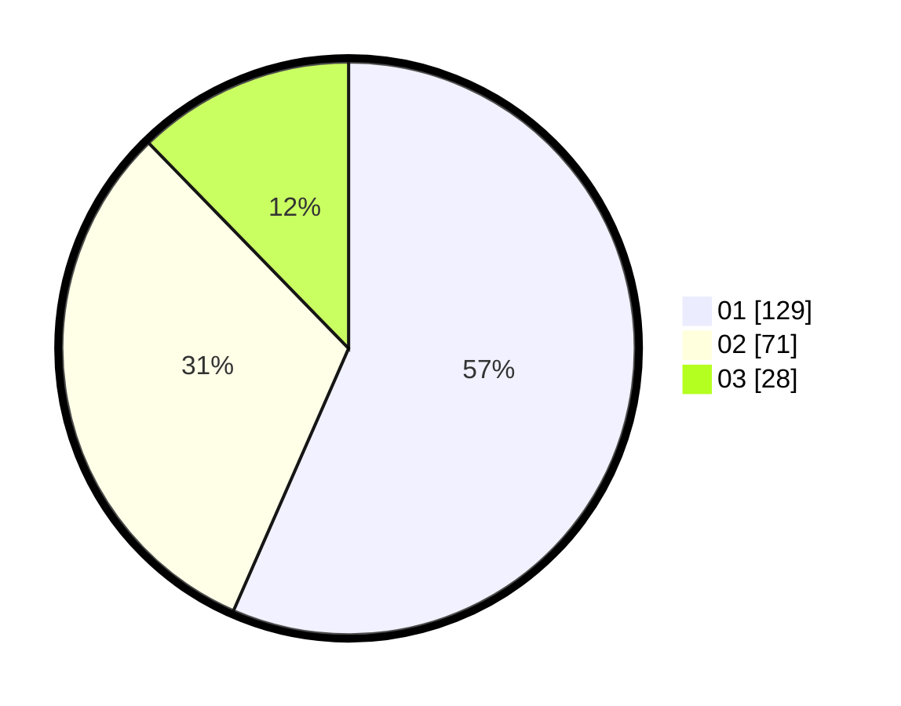

# Hasil

Hasil perolehan suara paslon dapat dilihat pada file paslon-01.txt, paslon-02.txt, dan paslon-03.txt.

Jika tidak ada, artinya data tersebut belum ada pada SIREKAP.

## Perolehan Suara

 * Paslon 01: **129**.
 * Paslon 02: **71**.
 * Paslon 03: **28**.

## Foto C Plano

https://sirekap-obj-formc.kpu.go.id/9603/pemilu/ppwp/31/75/02/10/05/3175021005048-20240215-204634--9cb48608-9491-4da2-84f3-6ee6353f0bc7.jpg

https://sirekap-obj-formc.kpu.go.id/9603/pemilu/ppwp/31/75/02/10/05/3175021005048-20240215-204636--7182ec3a-8a06-4f9d-929b-8f083f81becc.jpg

https://sirekap-obj-formc.kpu.go.id/9603/pemilu/ppwp/31/75/02/10/05/3175021005048-20240215-204635--7b0b6d5e-dfb6-4c5c-9d74-d01168936f60.jpg

## DATA PEMILIH TETAP

Jumlah pemilih dalam DPT: **290**.
 * L: **133**.
 * P: **157**.

## DATA PENGGUNA HAK PILIH

Jumlah pengguna hak pilih dalam DPT: **223**.
 * L: **98**.
 * P: **125**.

Jumlah pengguna hak pilih dalam DPTb: **4**.
 * L: **0**.
 * P: **4**.

Jumlah pengguna hak pilih dalam DPK: **2**.
 * L: **1**.
 * P: **1**.

Jumlah pengguna hak pilih: **229**.
 * L: **99**.
 * P: **130**.

## JUMLAH SUARA SAH DAN TIDAK SAH

JUMLAH SELURUH SUARA SAH: **228**.

JUMLAH SUARA TIDAK SAH: **1**.

JUMLAH SELURUH SUARA SAH DAN SUARA TIDAK SAH: **229**.
