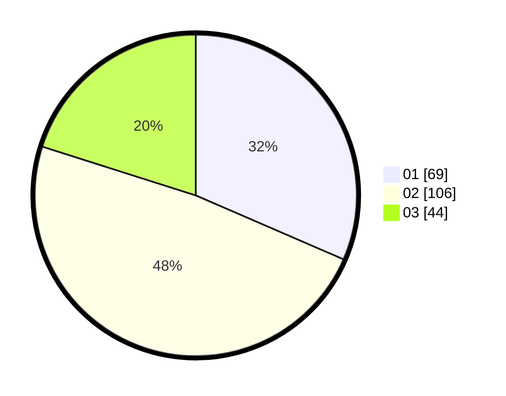

# Hasil

Hasil perolehan suara paslon dapat dilihat pada file paslon-01.txt, paslon-02.txt, dan paslon-03.txt.

Jika tidak ada, artinya data tersebut belum ada pada SIREKAP.

## Perolehan Suara

 * Paslon 01: **69**.
 * Paslon 02: **106**.
 * Paslon 03: **44**.

## Foto C Plano

https://sirekap-obj-formc.kpu.go.id/00e7/pemilu/ppwp/31/75/02/10/05/3175021005061-20240216-000359--64361a58-ce6f-4dcf-8041-fa24df844e36.jpg

https://sirekap-obj-formc.kpu.go.id/00e7/pemilu/ppwp/31/75/02/10/05/3175021005061-20240216-000401--436ceaa7-1f9a-47a5-bb7b-26672b22f30f.jpg

https://sirekap-obj-formc.kpu.go.id/00e7/pemilu/ppwp/31/75/02/10/05/3175021005061-20240216-000400--fe91c69d-5928-4fb4-97f7-158e98a1d811.jpg

## DATA PEMILIH TETAP

Jumlah pemilih dalam DPT: **277**.
 * L: **137**.
 * P: **140**.

## DATA PENGGUNA HAK PILIH

Jumlah pengguna hak pilih dalam DPT: **218**.
 * L: **107**.
 * P: **111**.

Jumlah pengguna hak pilih dalam DPTb: **0**.
 * L: **0**.
 * P: **0**.

Jumlah pengguna hak pilih dalam DPK: **1**.
 * L: **1**.
 * P: **0**.

Jumlah pengguna hak pilih: **219**.
 * L: **108**.
 * P: **111**.

## JUMLAH SUARA SAH DAN TIDAK SAH

JUMLAH SELURUH SUARA SAH: **219**.

JUMLAH SUARA TIDAK SAH: **0**.

JUMLAH SELURUH SUARA SAH DAN SUARA TIDAK SAH: **219**.
