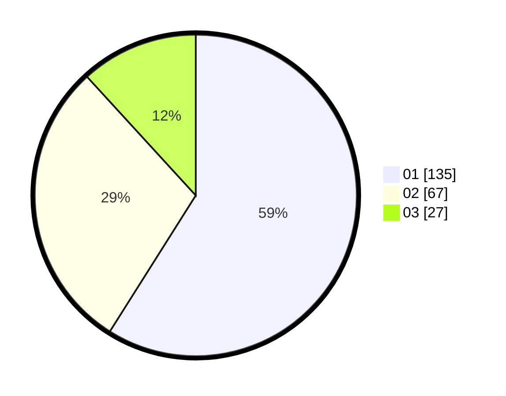

# Hasil

Hasil perolehan suara paslon dapat dilihat pada file paslon-01.txt, paslon-02.txt, dan paslon-03.txt.

Jika tidak ada, artinya data tersebut belum ada pada SIREKAP.

## Perolehan Suara

 * Paslon 01: **135**.
 * Paslon 02: **67**.
 * Paslon 03: **27**.

## Foto C Plano

https://sirekap-obj-formc.kpu.go.id/6511/pemilu/ppwp/31/75/02/10/05/3175021005067-20240216-050105--ce4f3ac6-c88c-409d-b1ad-12838eda1a32.jpg

https://sirekap-obj-formc.kpu.go.id/6511/pemilu/ppwp/31/75/02/10/05/3175021005067-20240216-050108--4d4b837f-6ca2-409f-acaf-f62fd54487e2.jpg

https://sirekap-obj-formc.kpu.go.id/6511/pemilu/ppwp/31/75/02/10/05/3175021005067-20240216-050106--c19c9943-e88f-49d5-a3b1-22b2444f4205.jpg

## DATA PEMILIH TETAP

Jumlah pemilih dalam DPT: **295**.
 * L: **147**.
 * P: **148**.

## DATA PENGGUNA HAK PILIH

Jumlah pengguna hak pilih dalam DPT: **222**.
 * L: **106**.
 * P: **116**.

Jumlah pengguna hak pilih dalam DPTb: **9**.
 * L: **7**.
 * P: **2**.

Jumlah pengguna hak pilih dalam DPK: **4**.
 * L: **2**.
 * P: **2**.

Jumlah pengguna hak pilih: **235**.
 * L: **115**.
 * P: **120**.

## JUMLAH SUARA SAH DAN TIDAK SAH

JUMLAH SELURUH SUARA SAH: **229**.

JUMLAH SUARA TIDAK SAH: **6**.

JUMLAH SELURUH SUARA SAH DAN SUARA TIDAK SAH: **235**.
