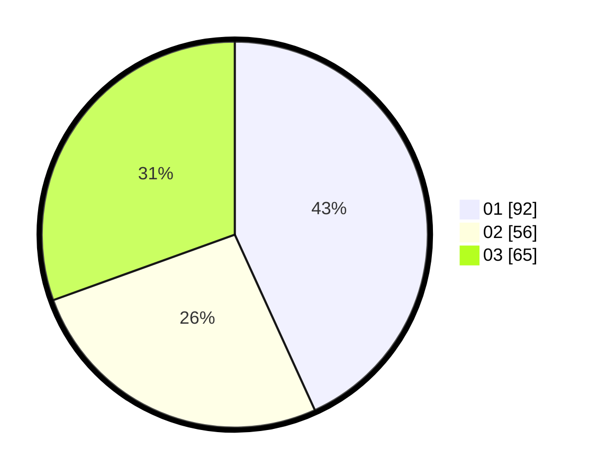

# Hasil

Hasil perolehan suara paslon dapat dilihat pada file paslon-01.txt, paslon-02.txt, dan paslon-03.txt.

Jika tidak ada, artinya data tersebut belum ada pada SIREKAP.

## Perolehan Suara

 * Paslon 01: **92**.
 * Paslon 02: **56**.
 * Paslon 03: **65**.

## Foto C Plano

https://sirekap-obj-formc.kpu.go.id/1b51/pemilu/ppwp/31/75/02/10/05/3175021005078-20240214-221759--52c9d184-ed06-48ef-8fa8-9d93eb425436.jpg

https://sirekap-obj-formc.kpu.go.id/1b51/pemilu/ppwp/31/75/02/10/05/3175021005078-20240214-221820--db821489-a998-46d5-beaf-de70a47c8e01.jpg

https://sirekap-obj-formc.kpu.go.id/1b51/pemilu/ppwp/31/75/02/10/05/3175021005078-20240214-221809--352f6dc2-4923-4577-8669-c4b58307e9c5.jpg

## DATA PEMILIH TETAP

Jumlah pemilih dalam DPT: **272**.
 * L: **132**.
 * P: **140**.

## DATA PENGGUNA HAK PILIH

Jumlah pengguna hak pilih dalam DPT: **207**.
 * L: **99**.
 * P: **108**.

Jumlah pengguna hak pilih dalam DPTb: **11**.
 * L: **6**.
 * P: **5**.

Jumlah pengguna hak pilih dalam DPK: **2**.
 * L: **2**.
 * P: **0**.

Jumlah pengguna hak pilih: **220**.
 * L: **107**.
 * P: **113**.

## JUMLAH SUARA SAH DAN TIDAK SAH

JUMLAH SELURUH SUARA SAH: **213**.

JUMLAH SUARA TIDAK SAH: **7**.

JUMLAH SELURUH SUARA SAH DAN SUARA TIDAK SAH: **220**.
