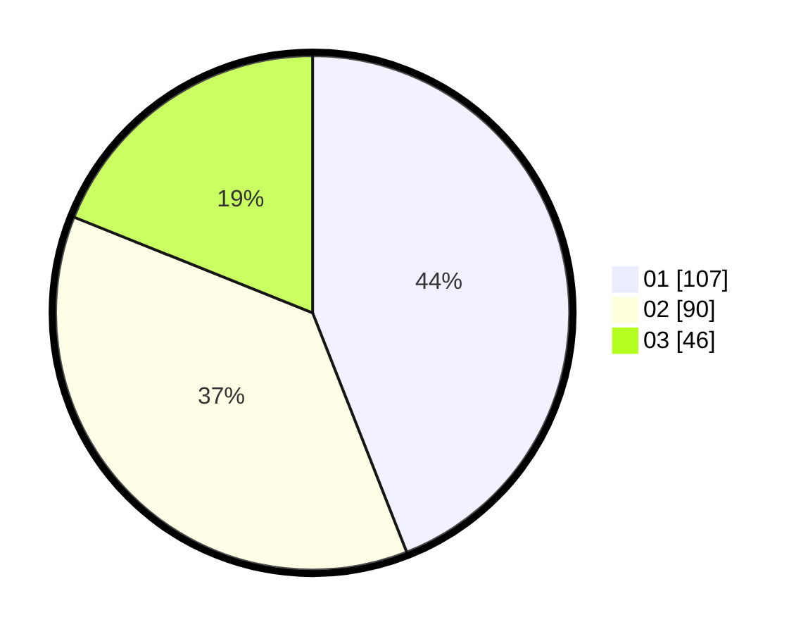

# Hasil

Hasil perolehan suara paslon dapat dilihat pada file paslon-01.txt, paslon-02.txt, dan paslon-03.txt.

Jika tidak ada, artinya data tersebut belum ada pada SIREKAP.

## Perolehan Suara

 * Paslon 01: **107**.
 * Paslon 02: **90**.
 * Paslon 03: **46**.

## Foto C Plano

https://sirekap-obj-formc.kpu.go.id/1cfd/pemilu/ppwp/31/75/02/10/05/3175021005079-20240216-070111--08bc6f02-403a-46ff-abd5-e1a0318cd791.jpg

https://sirekap-obj-formc.kpu.go.id/1cfd/pemilu/ppwp/31/75/02/10/05/3175021005079-20240216-070115--12c2109e-2636-4b40-a1c5-c360abf12fda.jpg

https://sirekap-obj-formc.kpu.go.id/1cfd/pemilu/ppwp/31/75/02/10/05/3175021005079-20240216-070112--0313bd48-415f-4164-97cd-0c1aa5e27da8.jpg

## DATA PEMILIH TETAP

Jumlah pemilih dalam DPT: **280**.
 * L: **129**.
 * P: **151**.

## DATA PENGGUNA HAK PILIH

Jumlah pengguna hak pilih dalam DPT: **235**.
 * L: **103**.
 * P: **132**.

Jumlah pengguna hak pilih dalam DPTb: **7**.
 * L: **0**.
 * P: **7**.

Jumlah pengguna hak pilih dalam DPK: **3**.
 * L: **2**.
 * P: **1**.

Jumlah pengguna hak pilih: **245**.
 * L: **105**.
 * P: **140**.

## JUMLAH SUARA SAH DAN TIDAK SAH

JUMLAH SELURUH SUARA SAH: **243**.

JUMLAH SUARA TIDAK SAH: **2**.

JUMLAH SELURUH SUARA SAH DAN SUARA TIDAK SAH: **245**.
