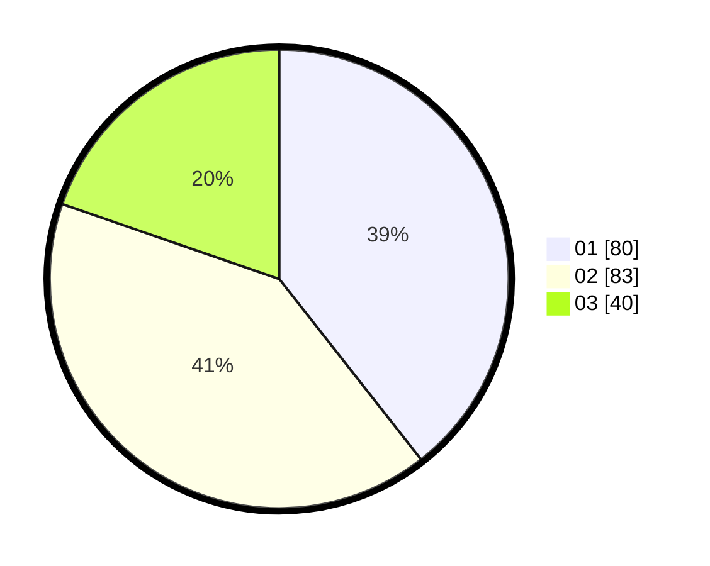

# Hasil

Hasil perolehan suara paslon dapat dilihat pada file paslon-01.txt, paslon-02.txt, dan paslon-03.txt.

Jika tidak ada, artinya data tersebut belum ada pada SIREKAP.

## Perolehan Suara

 * Paslon 01: **80**.
 * Paslon 02: **83**.
 * Paslon 03: **40**.

## Foto C Plano

https://sirekap-obj-formc.kpu.go.id/066c/pemilu/ppwp/31/75/02/10/05/3175021005080-20240216-082346--646b0f48-4676-42de-9fd8-799fa0c8aa7d.jpg

https://sirekap-obj-formc.kpu.go.id/066c/pemilu/ppwp/31/75/02/10/05/3175021005080-20240216-082348--b36a17de-a85e-4d8d-9a1b-c52da3d8c852.jpg

https://sirekap-obj-formc.kpu.go.id/066c/pemilu/ppwp/31/75/02/10/05/3175021005080-20240216-082347--478b10b9-dc4b-44a4-a728-65f1189d3e0d.jpg

## DATA PEMILIH TETAP

Jumlah pemilih dalam DPT: **276**.
 * L: **132**.
 * P: **144**.

## DATA PENGGUNA HAK PILIH

Jumlah pengguna hak pilih dalam DPT: **202**.
 * L: **96**.
 * P: **106**.

Jumlah pengguna hak pilih dalam DPTb: **4**.
 * L: **4**.
 * P: **0**.

Jumlah pengguna hak pilih dalam DPK: **1**.
 * L: **0**.
 * P: **1**.

Jumlah pengguna hak pilih: **207**.
 * L: **100**.
 * P: **107**.

## JUMLAH SUARA SAH DAN TIDAK SAH

JUMLAH SELURUH SUARA SAH: **203**.

JUMLAH SUARA TIDAK SAH: **4**.

JUMLAH SELURUH SUARA SAH DAN SUARA TIDAK SAH: **207**.
