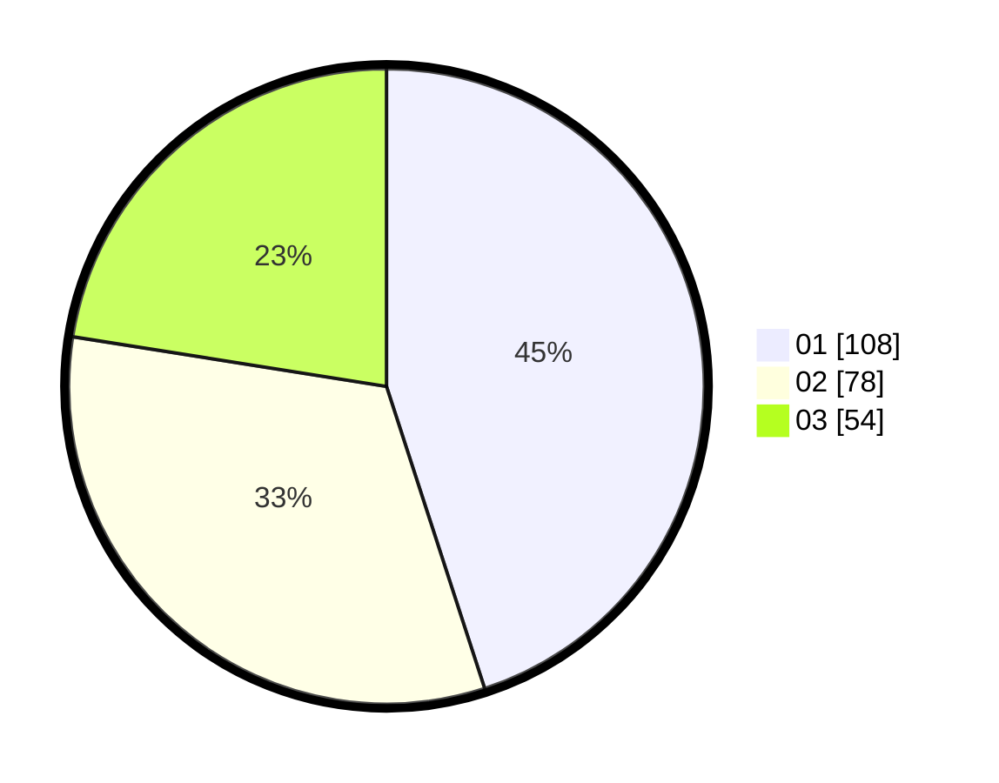

# Hasil

Hasil perolehan suara paslon dapat dilihat pada file paslon-01.txt, paslon-02.txt, dan paslon-03.txt.

Jika tidak ada, artinya data tersebut belum ada pada SIREKAP.

## Perolehan Suara

 * Paslon 01: **108**.
 * Paslon 02: **78**.
 * Paslon 03: **54**.

## Foto C Plano

https://sirekap-obj-formc.kpu.go.id/880a/pemilu/ppwp/31/75/02/10/05/3175021005082-20240214-160139--c9f3b625-8e73-4e66-b991-e68d94d86a5e.jpg

https://sirekap-obj-formc.kpu.go.id/880a/pemilu/ppwp/31/75/02/10/05/3175021005082-20240215-164441--4c04170e-8a86-45aa-8fba-e1abb6988cad.jpg

https://sirekap-obj-formc.kpu.go.id/880a/pemilu/ppwp/31/75/02/10/05/3175021005082-20240214-215606--7ecd2234-fa07-43c4-bc6f-0ae5407e3f01.jpg
