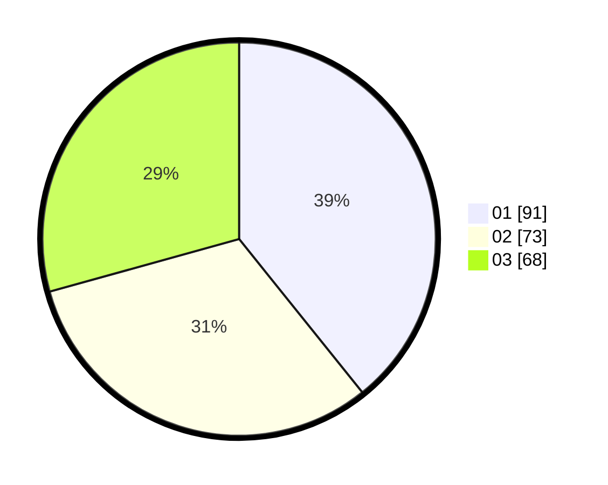

# Hasil

Hasil perolehan suara paslon dapat dilihat pada file paslon-01.txt, paslon-02.txt, dan paslon-03.txt.

Jika tidak ada, artinya data tersebut belum ada pada SIREKAP.

## Perolehan Suara

 * Paslon 01: **91**.
 * Paslon 02: **73**.
 * Paslon 03: **68**.

## Foto C Plano

https://sirekap-obj-formc.kpu.go.id/e2e4/pemilu/ppwp/31/75/02/10/05/3175021005083-20240216-065500--726dcc55-396a-4f66-9aba-7019b5fdbda2.jpg

https://sirekap-obj-formc.kpu.go.id/e2e4/pemilu/ppwp/31/75/02/10/05/3175021005083-20240216-070219--dcf6b69f-a871-4580-b93f-d22325e98370.jpg

https://sirekap-obj-formc.kpu.go.id/e2e4/pemilu/ppwp/31/75/02/10/05/3175021005083-20240216-065503--a7c8eabd-0581-4d5c-b9c9-35775ea14d8b.jpg

## DATA PEMILIH TETAP

Jumlah pemilih dalam DPT: **275**.
 * L: **126**.
 * P: **149**.

## DATA PENGGUNA HAK PILIH

Jumlah pengguna hak pilih dalam DPT: **231**.
 * L: **106**.
 * P: **125**.

Jumlah pengguna hak pilih dalam DPTb: **3**.
 * L: **1**.
 * P: **2**.

Jumlah pengguna hak pilih dalam DPK: **3**.
 * L: **1**.
 * P: **2**.

Jumlah pengguna hak pilih: **237**.
 * L: **108**.
 * P: **129**.

## JUMLAH SUARA SAH DAN TIDAK SAH

JUMLAH SELURUH SUARA SAH: **232**.

JUMLAH SUARA TIDAK SAH: **5**.

JUMLAH SELURUH SUARA SAH DAN SUARA TIDAK SAH: **237**.
