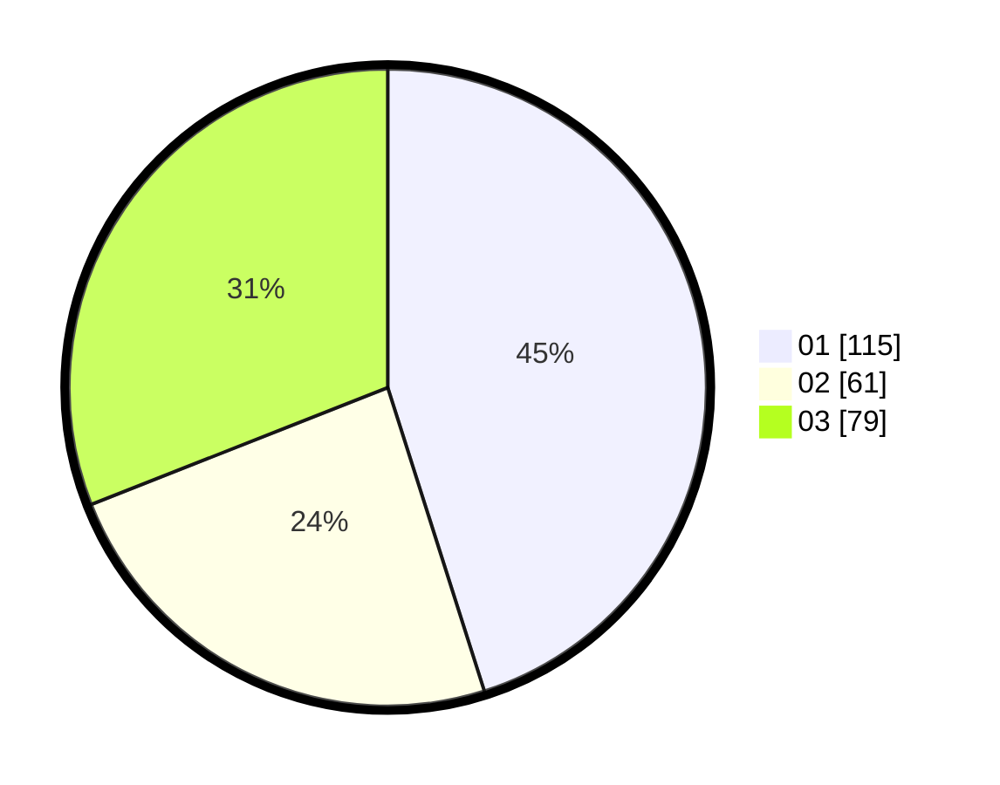

# Hasil

Hasil perolehan suara paslon dapat dilihat pada file paslon-01.txt, paslon-02.txt, dan paslon-03.txt.

Jika tidak ada, artinya data tersebut belum ada pada SIREKAP.

## Perolehan Suara

 * Paslon 01: **115**.
 * Paslon 02: **61**.
 * Paslon 03: **79**.

## Foto C Plano

https://sirekap-obj-formc.kpu.go.id/b5fc/pemilu/ppwp/31/75/02/10/05/3175021005084-20240215-205650--9aab1fb5-3a51-4bc6-9a06-3f695bf648d7.jpg

https://sirekap-obj-formc.kpu.go.id/b5fc/pemilu/ppwp/31/75/02/10/05/3175021005084-20240215-205652--54b2c5f3-6fe2-4790-85c1-30f941bf30aa.jpg

https://sirekap-obj-formc.kpu.go.id/b5fc/pemilu/ppwp/31/75/02/10/05/3175021005084-20240215-205650--4139f480-a049-48ff-900b-635f919755c3.jpg

## DATA PEMILIH TETAP

Jumlah pemilih dalam DPT: **289**.
 * L: **122**.
 * P: **167**.

## DATA PENGGUNA HAK PILIH

Jumlah pengguna hak pilih dalam DPT: **246**.
 * L: **102**.
 * P: **144**.

Jumlah pengguna hak pilih dalam DPTb: **7**.
 * L: **3**.
 * P: **4**.

Jumlah pengguna hak pilih dalam DPK: **4**.
 * L: **2**.
 * P: **2**.

Jumlah pengguna hak pilih: **257**.
 * L: **107**.
 * P: **150**.

## JUMLAH SUARA SAH DAN TIDAK SAH

JUMLAH SELURUH SUARA SAH: **255**.

JUMLAH SUARA TIDAK SAH: **2**.

JUMLAH SELURUH SUARA SAH DAN SUARA TIDAK SAH: **257**.
