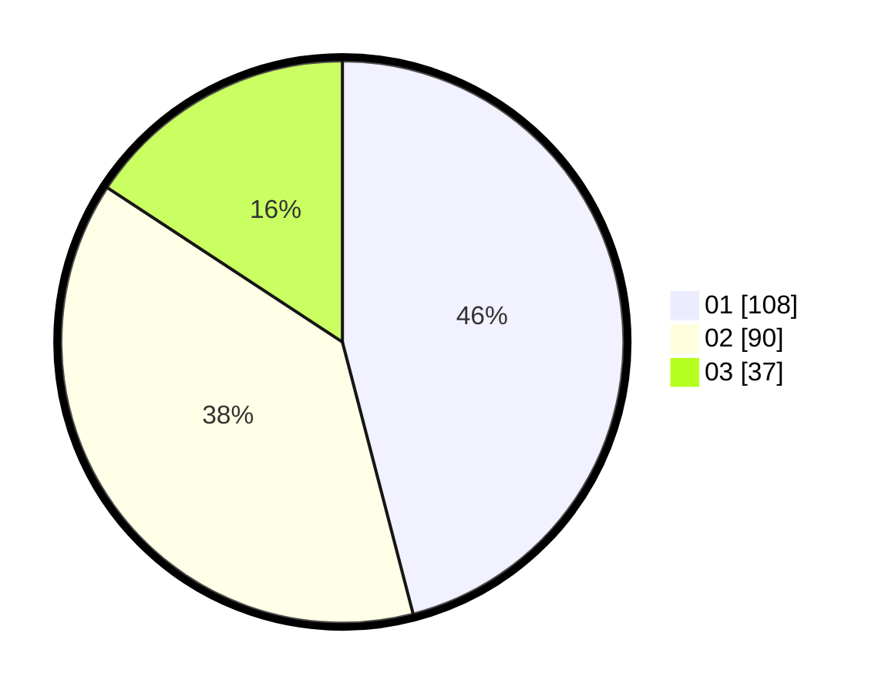

# Hasil

Hasil perolehan suara paslon dapat dilihat pada file paslon-01.txt, paslon-02.txt, dan paslon-03.txt.

Jika tidak ada, artinya data tersebut belum ada pada SIREKAP.

## Perolehan Suara

 * Paslon 01: **108**.
 * Paslon 02: **90**.
 * Paslon 03: **37**.

## Foto C Plano

https://sirekap-obj-formc.kpu.go.id/835e/pemilu/ppwp/31/75/02/10/05/3175021005096-20240215-235723--5af8454d-f9a8-45ee-b794-04b130765757.jpg

https://sirekap-obj-formc.kpu.go.id/835e/pemilu/ppwp/31/75/02/10/05/3175021005096-20240214-193131--c337bdac-fbfe-412e-b419-730e0073ff5d.jpg

https://sirekap-obj-formc.kpu.go.id/835e/pemilu/ppwp/31/75/02/10/05/3175021005096-20240215-235725--a5c2653c-fc6e-4a2a-9d7c-e281fb1bdcc3.jpg

## DATA PEMILIH TETAP

Jumlah pemilih dalam DPT: **283**.
 * L: **151**.
 * P: **132**.

## DATA PENGGUNA HAK PILIH

Jumlah pengguna hak pilih dalam DPT: **227**.
 * L: **116**.
 * P: **111**.

Jumlah pengguna hak pilih dalam DPTb: **8**.
 * L: **4**.
 * P: **4**.

Jumlah pengguna hak pilih dalam DPK: **1**.
 * L: **1**.
 * P: **0**.

Jumlah pengguna hak pilih: **236**.
 * L: **121**.
 * P: **115**.

## JUMLAH SUARA SAH DAN TIDAK SAH

JUMLAH SELURUH SUARA SAH: **235**.

JUMLAH SUARA TIDAK SAH: **1**.

JUMLAH SELURUH SUARA SAH DAN SUARA TIDAK SAH: **236**.
