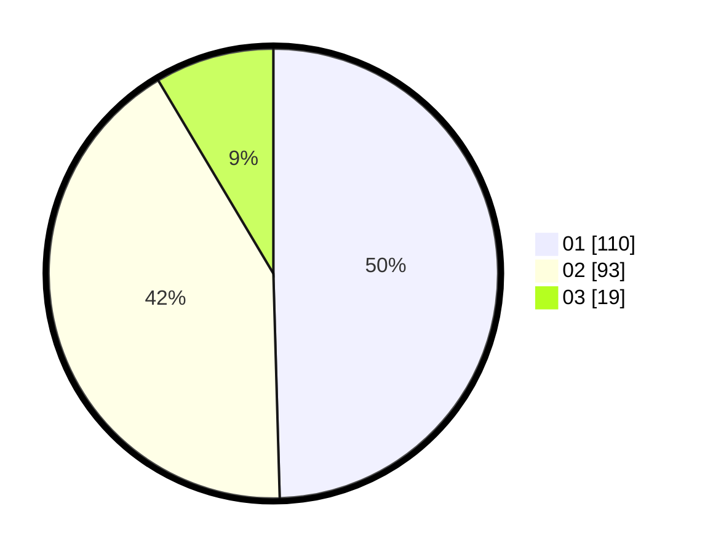

# Hasil

Hasil perolehan suara paslon dapat dilihat pada file paslon-01.txt, paslon-02.txt, dan paslon-03.txt.

Jika tidak ada, artinya data tersebut belum ada pada SIREKAP.

## Perolehan Suara

 * Paslon 01: **110**.
 * Paslon 02: **93**.
 * Paslon 03: **19**.

## Foto C Plano

https://sirekap-obj-formc.kpu.go.id/fbff/pemilu/ppwp/31/75/02/10/05/3175021005110-20240216-210551--74111274-d8ee-4097-b9cb-75b37c2feb69.jpg

https://sirekap-obj-formc.kpu.go.id/fbff/pemilu/ppwp/31/75/02/10/05/3175021005110-20240216-155736--a628c209-6cee-4156-94ec-ff36bbe40b7e.jpg
