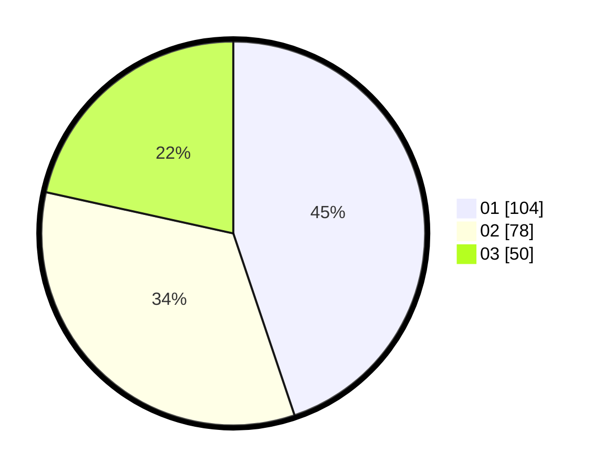

# Hasil

Hasil perolehan suara paslon dapat dilihat pada file paslon-01.txt, paslon-02.txt, dan paslon-03.txt.

Jika tidak ada, artinya data tersebut belum ada pada SIREKAP.

## Perolehan Suara

 * Paslon 01: **104**.
 * Paslon 02: **78**.
 * Paslon 03: **50**.

## Foto C Plano

https://sirekap-obj-formc.kpu.go.id/942d/pemilu/ppwp/31/75/02/10/05/3175021005122-20240214-155136--3657a9e1-4e91-4bf6-b45b-653b097792b4.jpg

https://sirekap-obj-formc.kpu.go.id/942d/pemilu/ppwp/31/75/02/10/05/3175021005122-20240214-155622--8953074d-9d4a-4365-86e6-124e021bd196.jpg

https://sirekap-obj-formc.kpu.go.id/942d/pemilu/ppwp/31/75/02/10/05/3175021005122-20240214-155731--9bf571c1-cbce-427b-80b4-d2bda687bdb5.jpg

## DATA PEMILIH TETAP

Jumlah pemilih dalam DPT: **292**.
 * L: **141**.
 * P: **151**.

## DATA PENGGUNA HAK PILIH

Jumlah pengguna hak pilih dalam DPT: **229**.
 * L: **108**.
 * P: **121**.

Jumlah pengguna hak pilih dalam DPTb: **4**.
 * L: **2**.
 * P: **2**.

Jumlah pengguna hak pilih dalam DPK: **2**.
 * L: **0**.
 * P: **2**.

Jumlah pengguna hak pilih: **235**.
 * L: **110**.
 * P: **121**.

## JUMLAH SUARA SAH DAN TIDAK SAH

JUMLAH SELURUH SUARA SAH: **232**.

JUMLAH SUARA TIDAK SAH: **3**.

JUMLAH SELURUH SUARA SAH DAN SUARA TIDAK SAH: **235**.
