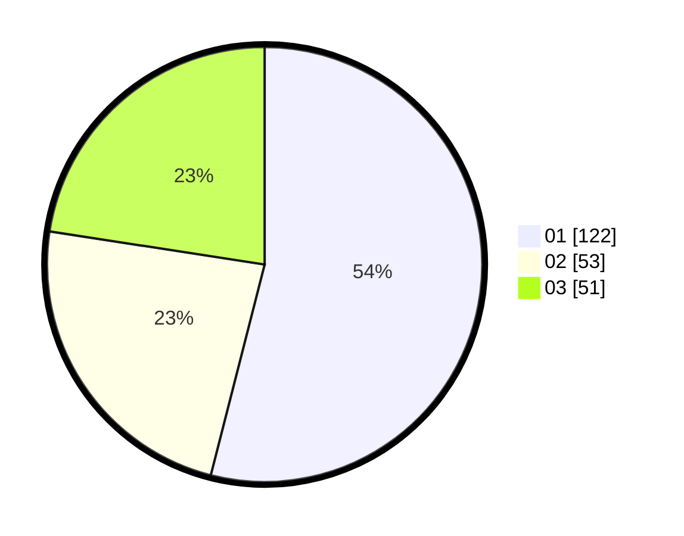

# Hasil

Hasil perolehan suara paslon dapat dilihat pada file paslon-01.txt, paslon-02.txt, dan paslon-03.txt.

Jika tidak ada, artinya data tersebut belum ada pada SIREKAP.

## Perolehan Suara

 * Paslon 01: **122**.
 * Paslon 02: **53**.
 * Paslon 03: **51**.

## Foto C Plano

https://sirekap-obj-formc.kpu.go.id/5abd/pemilu/ppwp/31/75/02/10/06/3175021006011-20240214-204751--620f9fdd-ea00-4a46-a1c8-2859b1561c10.jpg

https://sirekap-obj-formc.kpu.go.id/5abd/pemilu/ppwp/31/75/02/10/06/3175021006011-20240214-155459--09c3b2f7-6d21-46aa-95a3-0a55294be49e.jpg

https://sirekap-obj-formc.kpu.go.id/5abd/pemilu/ppwp/31/75/02/10/06/3175021006011-20240214-205246--a046be7a-38ca-49d1-b330-80974dcd28e8.jpg

## DATA PEMILIH TETAP

Jumlah pemilih dalam DPT: **264**.
 * L: **127**.
 * P: **137**.

## DATA PENGGUNA HAK PILIH

Jumlah pengguna hak pilih dalam DPT: **223**.
 * L: **101**.
 * P: **122**.

Jumlah pengguna hak pilih dalam DPTb: **6**.
 * L: **3**.
 * P: **3**.

Jumlah pengguna hak pilih dalam DPK: **1**.
 * L: **1**.
 * P: **0**.

Jumlah pengguna hak pilih: **230**.
 * L: **105**.
 * P: **125**.

## JUMLAH SUARA SAH DAN TIDAK SAH

JUMLAH SELURUH SUARA SAH: **226**.

JUMLAH SUARA TIDAK SAH: **4**.

JUMLAH SELURUH SUARA SAH DAN SUARA TIDAK SAH: **230**.
