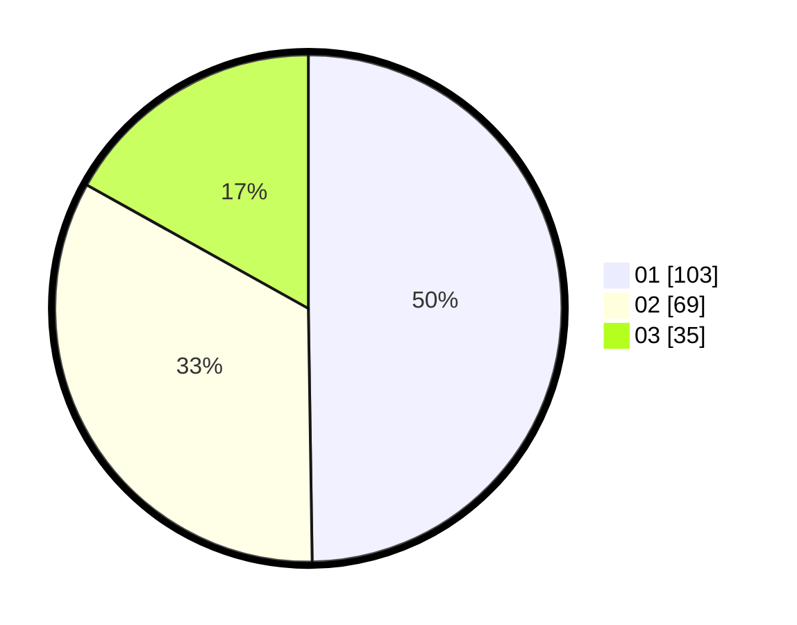

# Hasil

Hasil perolehan suara paslon dapat dilihat pada file paslon-01.txt, paslon-02.txt, dan paslon-03.txt.

Jika tidak ada, artinya data tersebut belum ada pada SIREKAP.

## Perolehan Suara

 * Paslon 01: **103**.
 * Paslon 02: **69**.
 * Paslon 03: **35**.

## Foto C Plano

https://sirekap-obj-formc.kpu.go.id/21d5/pemilu/ppwp/31/75/02/10/06/3175021006013-20240216-134811--2d090ec5-5043-4cc1-955a-9352b2aa74dd.jpg

https://sirekap-obj-formc.kpu.go.id/21d5/pemilu/ppwp/31/75/02/10/06/3175021006013-20240215-040150--59941eae-1eaa-4098-9701-8d34cbf3b034.jpg

https://sirekap-obj-formc.kpu.go.id/21d5/pemilu/ppwp/31/75/02/10/06/3175021006013-20240216-134812--ff9f1eac-f0fb-407e-b9ee-efd197473fb1.jpg

## DATA PEMILIH TETAP

Jumlah pemilih dalam DPT: **263**.
 * L: **127**.
 * P: **136**.

## DATA PENGGUNA HAK PILIH

Jumlah pengguna hak pilih dalam DPT: **204**.
 * L: **93**.
 * P: **111**.

Jumlah pengguna hak pilih dalam DPTb: **3**.
 * L: **3**.
 * P: **0**.

Jumlah pengguna hak pilih dalam DPK: **1**.
 * L: **0**.
 * P: **1**.

Jumlah pengguna hak pilih: **208**.
 * L: **96**.
 * P: **112**.

## JUMLAH SUARA SAH DAN TIDAK SAH

JUMLAH SELURUH SUARA SAH: **207**.

JUMLAH SUARA TIDAK SAH: **1**.

JUMLAH SELURUH SUARA SAH DAN SUARA TIDAK SAH: **208**.
