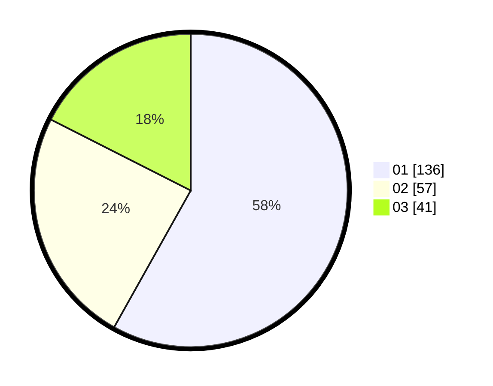

# Hasil

Hasil perolehan suara paslon dapat dilihat pada file paslon-01.txt, paslon-02.txt, dan paslon-03.txt.

Jika tidak ada, artinya data tersebut belum ada pada SIREKAP.

## Perolehan Suara

 * Paslon 01: **136**.
 * Paslon 02: **57**.
 * Paslon 03: **41**.

## Foto C Plano

https://sirekap-obj-formc.kpu.go.id/1453/pemilu/ppwp/31/75/02/10/06/3175021006018-20240214-190619--ef8673b5-b106-41e2-9791-d216d1e522a2.jpg

https://sirekap-obj-formc.kpu.go.id/1453/pemilu/ppwp/31/75/02/10/06/3175021006018-20240214-190446--55e5ae64-f22a-4439-86c1-99658c663e0a.jpg

https://sirekap-obj-formc.kpu.go.id/1453/pemilu/ppwp/31/75/02/10/06/3175021006018-20240214-190534--eb19dcf1-9969-4dd2-ae86-2d32bc489692.jpg

## DATA PEMILIH TETAP

Jumlah pemilih dalam DPT: **296**.
 * L: **142**.
 * P: **154**.

## DATA PENGGUNA HAK PILIH

Jumlah pengguna hak pilih dalam DPT: **227**.
 * L: **101**.
 * P: **126**.

Jumlah pengguna hak pilih dalam DPTb: **7**.
 * L: **5**.
 * P: **2**.

Jumlah pengguna hak pilih dalam DPK: **4**.
 * L: **2**.
 * P: **2**.

Jumlah pengguna hak pilih: **238**.
 * L: **108**.
 * P: **130**.

## JUMLAH SUARA SAH DAN TIDAK SAH

JUMLAH SELURUH SUARA SAH: **234**.

JUMLAH SUARA TIDAK SAH: **4**.

JUMLAH SELURUH SUARA SAH DAN SUARA TIDAK SAH: **238**.
