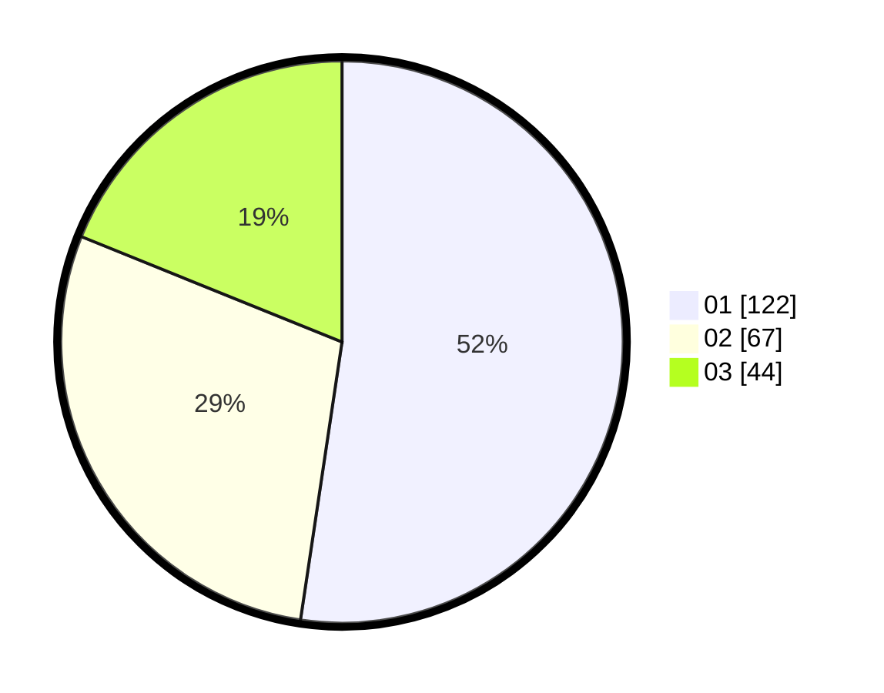

# Hasil

Hasil perolehan suara paslon dapat dilihat pada file paslon-01.txt, paslon-02.txt, dan paslon-03.txt.

Jika tidak ada, artinya data tersebut belum ada pada SIREKAP.

## Perolehan Suara

 * Paslon 01: **122**.
 * Paslon 02: **67**.
 * Paslon 03: **44**.

## Foto C Plano

https://sirekap-obj-formc.kpu.go.id/b592/pemilu/ppwp/31/75/02/10/06/3175021006030-20240214-232025--97bac44b-e644-47c9-b791-e7f18d7c5768.jpg

https://sirekap-obj-formc.kpu.go.id/b592/pemilu/ppwp/31/75/02/10/06/3175021006030-20240214-155739--4941762b-2e35-4018-aee2-e5fccbd8677f.jpg

https://sirekap-obj-formc.kpu.go.id/b592/pemilu/ppwp/31/75/02/10/06/3175021006030-20240214-155921--8526a78b-b073-41c8-b3fd-fd547536ae85.jpg
