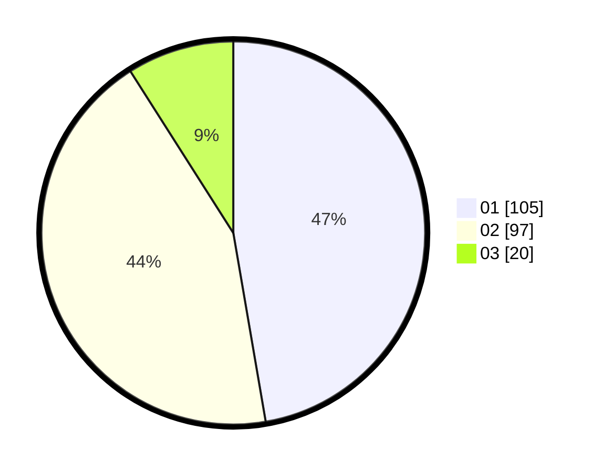

# Hasil

Hasil perolehan suara paslon dapat dilihat pada file paslon-01.txt, paslon-02.txt, dan paslon-03.txt.

Jika tidak ada, artinya data tersebut belum ada pada SIREKAP.

## Perolehan Suara

 * Paslon 01: **105**.
 * Paslon 02: **97**.
 * Paslon 03: **20**.

## Foto C Plano

https://sirekap-obj-formc.kpu.go.id/a01f/pemilu/ppwp/31/75/02/10/06/3175021006031-20240216-143603--4b50bbee-253b-424a-9cab-34447065c5e3.jpg

https://sirekap-obj-formc.kpu.go.id/a01f/pemilu/ppwp/31/75/02/10/06/3175021006031-20240214-230750--eb214f25-3625-46b1-a281-2cd27464325a.jpg

https://sirekap-obj-formc.kpu.go.id/a01f/pemilu/ppwp/31/75/02/10/06/3175021006031-20240214-230916--fa6d59d1-b4b1-4214-8d3f-781f4474d347.jpg

## DATA PEMILIH TETAP

Jumlah pemilih dalam DPT: **295**.
 * L: **153**.
 * P: **142**.

## DATA PENGGUNA HAK PILIH

Jumlah pengguna hak pilih dalam DPT: **218**.
 * L: **109**.
 * P: **109**.

Jumlah pengguna hak pilih dalam DPTb: **11**.
 * L: **4**.
 * P: **7**.

Jumlah pengguna hak pilih dalam DPK: **1**.
 * L: **1**.
 * P: **0**.

Jumlah pengguna hak pilih: **230**.
 * L: **114**.
 * P: **116**.

## JUMLAH SUARA SAH DAN TIDAK SAH

JUMLAH SELURUH SUARA SAH: **222**.

JUMLAH SUARA TIDAK SAH: **8**.

JUMLAH SELURUH SUARA SAH DAN SUARA TIDAK SAH: **230**.
