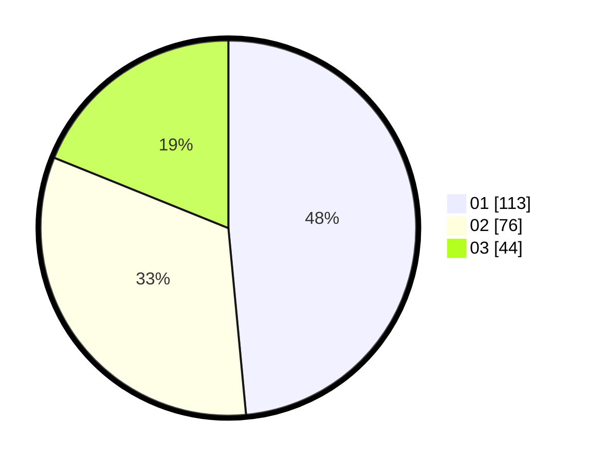

# Hasil

Hasil perolehan suara paslon dapat dilihat pada file paslon-01.txt, paslon-02.txt, dan paslon-03.txt.

Jika tidak ada, artinya data tersebut belum ada pada SIREKAP.

## Perolehan Suara

 * Paslon 01: **113**.
 * Paslon 02: **76**.
 * Paslon 03: **44**.

## Foto C Plano

https://sirekap-obj-formc.kpu.go.id/265e/pemilu/ppwp/31/75/02/10/06/3175021006034-20240215-011233--d6b66c16-966e-4c76-ba71-d12a6a9d2372.jpg

https://sirekap-obj-formc.kpu.go.id/265e/pemilu/ppwp/31/75/02/10/06/3175021006034-20240215-011345--2302ac52-bf00-498c-addf-c911b52be480.jpg

https://sirekap-obj-formc.kpu.go.id/265e/pemilu/ppwp/31/75/02/10/06/3175021006034-20240215-011530--6c7e5f1b-5a3b-4ebd-a55e-6fd371e3593b.jpg
