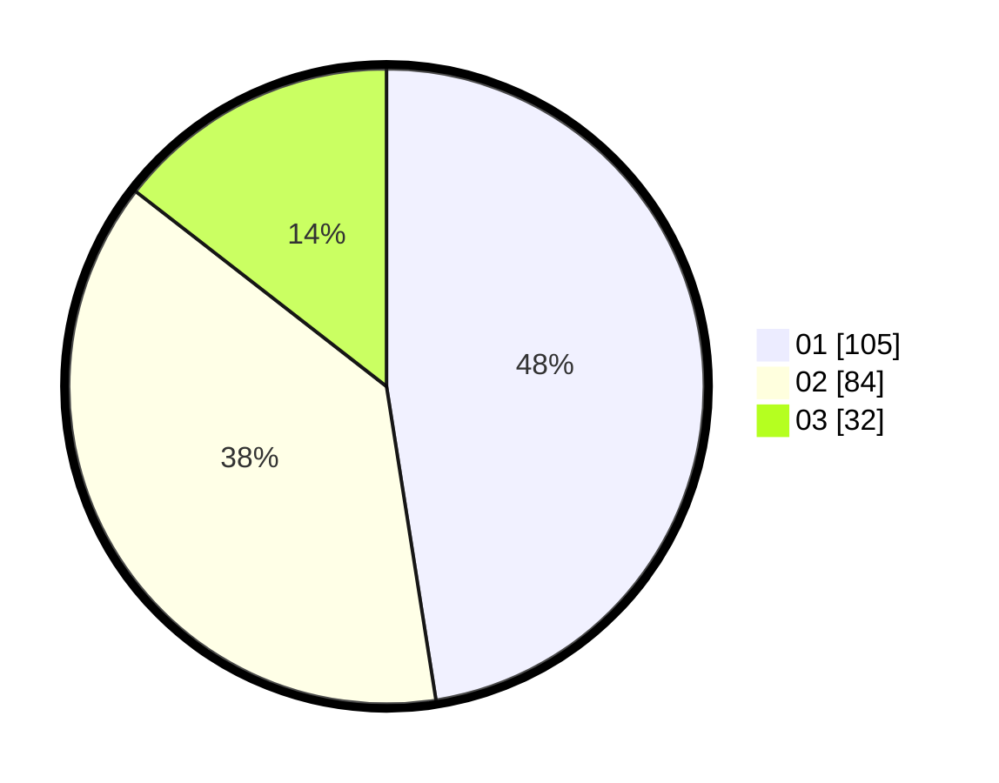

# Hasil

Hasil perolehan suara paslon dapat dilihat pada file paslon-01.txt, paslon-02.txt, dan paslon-03.txt.

Jika tidak ada, artinya data tersebut belum ada pada SIREKAP.

## Perolehan Suara

 * Paslon 01: **105**.
 * Paslon 02: **84**.
 * Paslon 03: **32**.

## Foto C Plano

https://sirekap-obj-formc.kpu.go.id/58ac/pemilu/ppwp/31/75/02/10/06/3175021006038-20240214-160146--8fc9d612-47be-472f-9950-58039ebafabd.jpg

https://sirekap-obj-formc.kpu.go.id/58ac/pemilu/ppwp/31/75/02/10/06/3175021006038-20240214-185338--3d3b2082-4dc0-45a2-a69c-cead331dcfc2.jpg

https://sirekap-obj-formc.kpu.go.id/58ac/pemilu/ppwp/31/75/02/10/06/3175021006038-20240214-184903--ebbe011e-b7e2-4eca-a264-1a8c50610be9.jpg

## DATA PEMILIH TETAP

Jumlah pemilih dalam DPT: **294**.
 * L: **139**.
 * P: **155**.

## DATA PENGGUNA HAK PILIH

Jumlah pengguna hak pilih dalam DPT: **219**.
 * L: **95**.
 * P: **124**.

Jumlah pengguna hak pilih dalam DPTb: **6**.
 * L: **0**.
 * P: **6**.

Jumlah pengguna hak pilih dalam DPK: **2**.
 * L: **1**.
 * P: **1**.

Jumlah pengguna hak pilih: **227**.
 * L: **96**.
 * P: **131**.

## JUMLAH SUARA SAH DAN TIDAK SAH

JUMLAH SELURUH SUARA SAH: **221**.

JUMLAH SUARA TIDAK SAH: **6**.

JUMLAH SELURUH SUARA SAH DAN SUARA TIDAK SAH: **227**.
