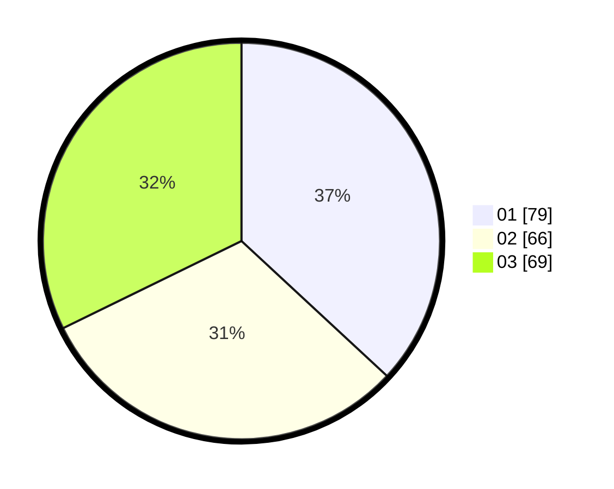

# Hasil

Hasil perolehan suara paslon dapat dilihat pada file paslon-01.txt, paslon-02.txt, dan paslon-03.txt.

Jika tidak ada, artinya data tersebut belum ada pada SIREKAP.

## Perolehan Suara

 * Paslon 01: **79**.
 * Paslon 02: **66**.
 * Paslon 03: **69**.

## Foto C Plano

https://sirekap-obj-formc.kpu.go.id/f30f/pemilu/ppwp/31/75/02/10/06/3175021006040-20240215-021956--7c8d97d8-44d4-4967-bd8a-40d2dd315912.jpg

https://sirekap-obj-formc.kpu.go.id/f30f/pemilu/ppwp/31/75/02/10/06/3175021006040-20240215-022107--b11d8058-23ca-4a3e-8248-3c7f9361cd93.jpg

https://sirekap-obj-formc.kpu.go.id/f30f/pemilu/ppwp/31/75/02/10/06/3175021006040-20240215-021709--36f0660c-53af-4d57-bb8f-0de1c4d739aa.jpg
