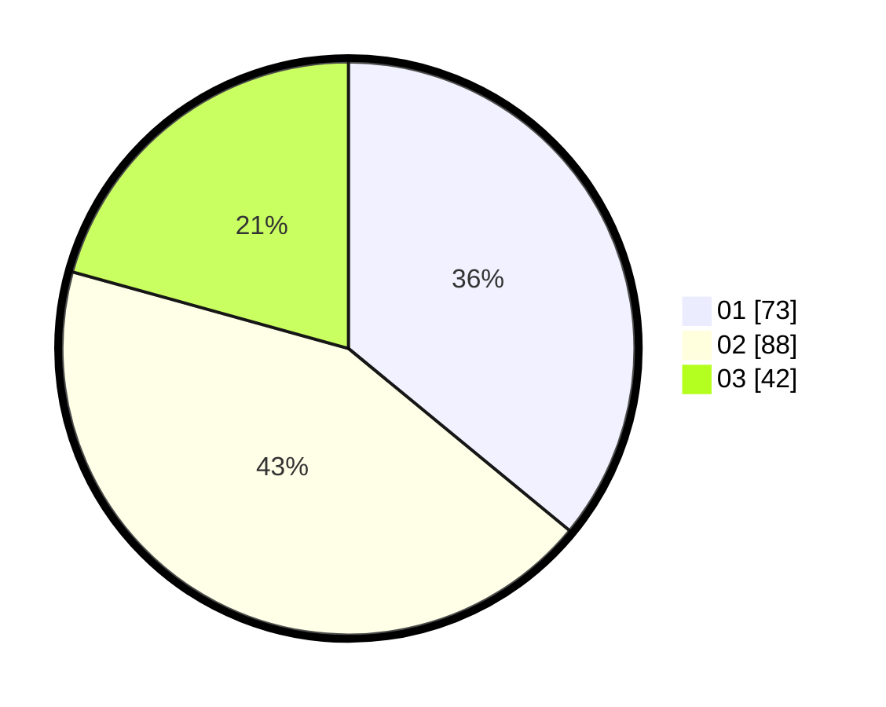

# Hasil

Hasil perolehan suara paslon dapat dilihat pada file paslon-01.txt, paslon-02.txt, dan paslon-03.txt.

Jika tidak ada, artinya data tersebut belum ada pada SIREKAP.

## Perolehan Suara

 * Paslon 01: **73**.
 * Paslon 02: **88**.
 * Paslon 03: **42**.

## Foto C Plano

https://sirekap-obj-formc.kpu.go.id/89ae/pemilu/ppwp/31/75/02/10/06/3175021006048-20240214-162242--39dbd15b-4521-4cab-84c7-3a16e0cfbadc.jpg

https://sirekap-obj-formc.kpu.go.id/89ae/pemilu/ppwp/31/75/02/10/06/3175021006048-20240214-191149--94b9bd51-236d-4ed4-91ae-2200a36ddc26.jpg

https://sirekap-obj-formc.kpu.go.id/89ae/pemilu/ppwp/31/75/02/10/06/3175021006048-20240214-191208--796c0d98-626b-47c0-8be0-b957d9566a5a.jpg

## DATA PEMILIH TETAP

Jumlah pemilih dalam DPT: **263**.
 * L: **133**.
 * P: **130**.

## DATA PENGGUNA HAK PILIH

Jumlah pengguna hak pilih dalam DPT: **203**.
 * L: **101**.
 * P: **102**.

Jumlah pengguna hak pilih dalam DPTb: **2**.
 * L: **0**.
 * P: **2**.

Jumlah pengguna hak pilih dalam DPK: **1**.
 * L: **0**.
 * P: **1**.

Jumlah pengguna hak pilih: **206**.
 * L: **101**.
 * P: **105**.

## JUMLAH SUARA SAH DAN TIDAK SAH

JUMLAH SELURUH SUARA SAH: **203**.

JUMLAH SUARA TIDAK SAH: **3**.

JUMLAH SELURUH SUARA SAH DAN SUARA TIDAK SAH: **206**.
