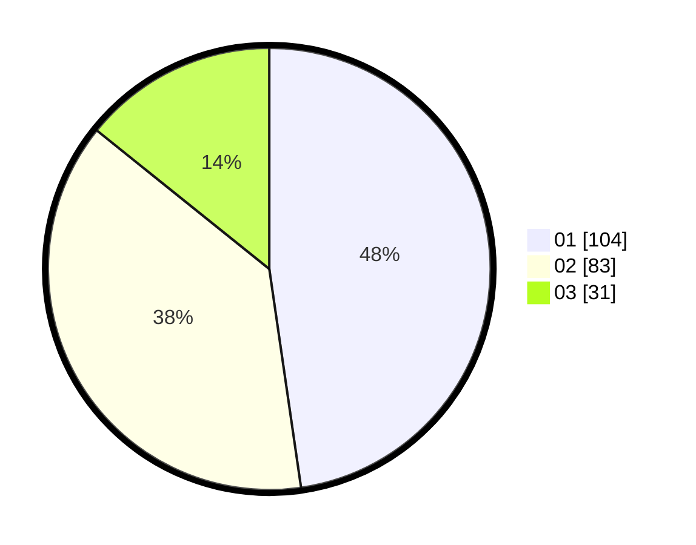

# Hasil

Hasil perolehan suara paslon dapat dilihat pada file paslon-01.txt, paslon-02.txt, dan paslon-03.txt.

Jika tidak ada, artinya data tersebut belum ada pada SIREKAP.

## Perolehan Suara

 * Paslon 01: **104**.
 * Paslon 02: **83**.
 * Paslon 03: **31**.

## Foto C Plano

https://sirekap-obj-formc.kpu.go.id/7dac/pemilu/ppwp/31/75/02/10/06/3175021006049-20240214-155529--8ab8373d-9316-424f-b7fa-bea4bf28d6d3.jpg

https://sirekap-obj-formc.kpu.go.id/7dac/pemilu/ppwp/31/75/02/10/06/3175021006049-20240214-155548--ab73e923-f749-44a8-84c0-32e1b590bee9.jpg

https://sirekap-obj-formc.kpu.go.id/7dac/pemilu/ppwp/31/75/02/10/06/3175021006049-20240214-155603--16e80e81-1fed-4263-a7f6-dcc2537bc25d.jpg

## DATA PEMILIH TETAP

Jumlah pemilih dalam DPT: **261**.
 * L: **133**.
 * P: **128**.

## DATA PENGGUNA HAK PILIH

Jumlah pengguna hak pilih dalam DPT: **218**.
 * L: **108**.
 * P: **110**.

Jumlah pengguna hak pilih dalam DPTb: **0**.
 * L: **0**.
 * P: **0**.

Jumlah pengguna hak pilih dalam DPK: **1**.
 * L: **0**.
 * P: **1**.

Jumlah pengguna hak pilih: **219**.
 * L: **108**.
 * P: **111**.

## JUMLAH SUARA SAH DAN TIDAK SAH

JUMLAH SELURUH SUARA SAH: **218**.

JUMLAH SUARA TIDAK SAH: **1**.

JUMLAH SELURUH SUARA SAH DAN SUARA TIDAK SAH: **219**.
