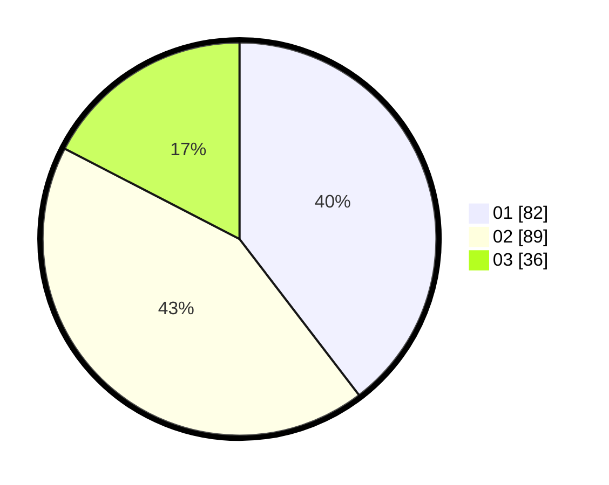

# Hasil

Hasil perolehan suara paslon dapat dilihat pada file paslon-01.txt, paslon-02.txt, dan paslon-03.txt.

Jika tidak ada, artinya data tersebut belum ada pada SIREKAP.

## Perolehan Suara

 * Paslon 01: **82**.
 * Paslon 02: **89**.
 * Paslon 03: **36**.

## Foto C Plano

https://sirekap-obj-formc.kpu.go.id/cb19/pemilu/ppwp/31/75/02/10/06/3175021006052-20240214-204324--3d541a21-2ec7-41d5-a20e-94e7b9cfa482.jpg

https://sirekap-obj-formc.kpu.go.id/cb19/pemilu/ppwp/31/75/02/10/06/3175021006052-20240214-204415--aabf1d0f-a7da-43e9-b173-964851826a56.jpg

https://sirekap-obj-formc.kpu.go.id/cb19/pemilu/ppwp/31/75/02/10/06/3175021006052-20240214-204645--b75e27a4-6094-4b4d-8cdc-cb8fa45263bb.jpg

## DATA PEMILIH TETAP

Jumlah pemilih dalam DPT: **270**.
 * L: **138**.
 * P: **132**.

## DATA PENGGUNA HAK PILIH

Jumlah pengguna hak pilih dalam DPT: **206**.
 * L: **100**.
 * P: **106**.

Jumlah pengguna hak pilih dalam DPTb: **0**.
 * L: **0**.
 * P: **0**.

Jumlah pengguna hak pilih dalam DPK: **7**.
 * L: **2**.
 * P: **5**.

Jumlah pengguna hak pilih: **213**.
 * L: **102**.
 * P: **111**.

## JUMLAH SUARA SAH DAN TIDAK SAH

JUMLAH SELURUH SUARA SAH: **207**.

JUMLAH SUARA TIDAK SAH: **6**.

JUMLAH SELURUH SUARA SAH DAN SUARA TIDAK SAH: **213**.
