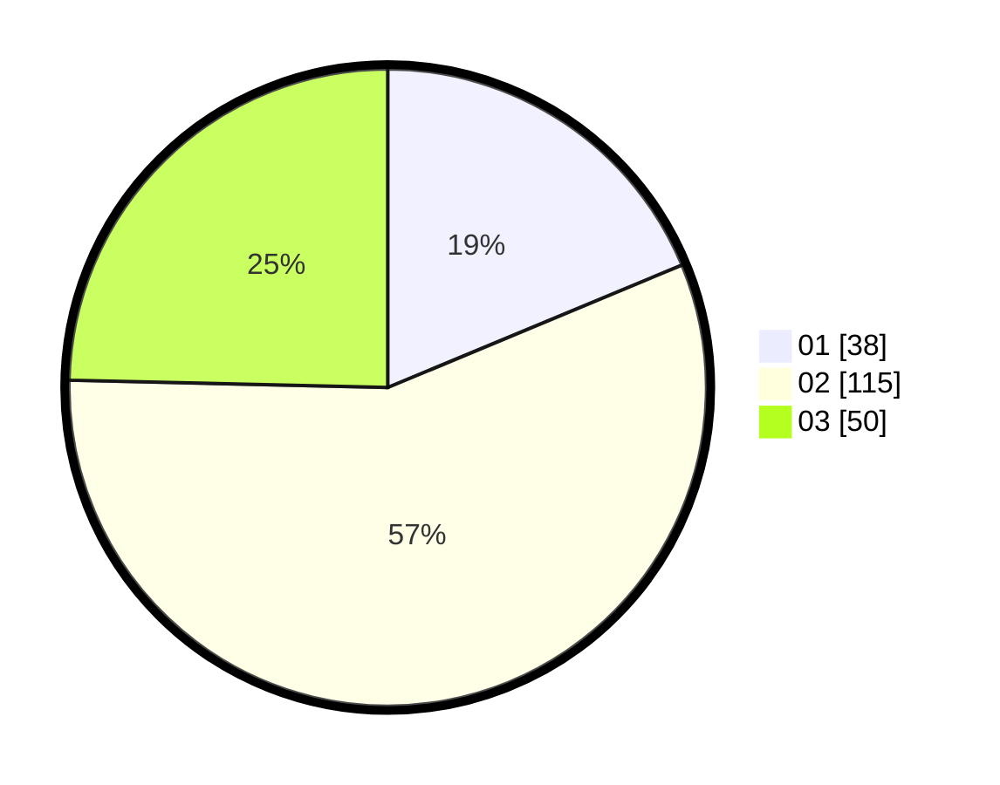

# Hasil

Hasil perolehan suara paslon dapat dilihat pada file paslon-01.txt, paslon-02.txt, dan paslon-03.txt.

Jika tidak ada, artinya data tersebut belum ada pada SIREKAP.

## Perolehan Suara

 * Paslon 01: **38**.
 * Paslon 02: **115**.
 * Paslon 03: **50**.

## Foto C Plano

https://sirekap-obj-formc.kpu.go.id/7675/pemilu/ppwp/31/75/02/10/06/3175021006060-20240215-053239--67bdc403-5571-4a72-ae4e-46c0efeb7567.jpg

https://sirekap-obj-formc.kpu.go.id/7675/pemilu/ppwp/31/75/02/10/06/3175021006060-20240215-053429--1e5632e7-d9ad-4cdb-875f-cf2473cb62b4.jpg

https://sirekap-obj-formc.kpu.go.id/7675/pemilu/ppwp/31/75/02/10/06/3175021006060-20240215-053600--e9924ab1-78d4-4c1e-b618-6e7bed7ba49e.jpg

## DATA PEMILIH TETAP

Jumlah pemilih dalam DPT: **276**.
 * L: **139**.
 * P: **137**.

## DATA PENGGUNA HAK PILIH

Jumlah pengguna hak pilih dalam DPT: **204**.
 * L: **97**.
 * P: **107**.

Jumlah pengguna hak pilih dalam DPTb: **2**.
 * L: **0**.
 * P: **2**.

Jumlah pengguna hak pilih dalam DPK: **2**.
 * L: **0**.
 * P: **2**.

Jumlah pengguna hak pilih: **206**.
 * L: **97**.
 * P: **109**.

## JUMLAH SUARA SAH DAN TIDAK SAH

JUMLAH SELURUH SUARA SAH: **203**.

JUMLAH SUARA TIDAK SAH: **3**.

JUMLAH SELURUH SUARA SAH DAN SUARA TIDAK SAH: **206**.
