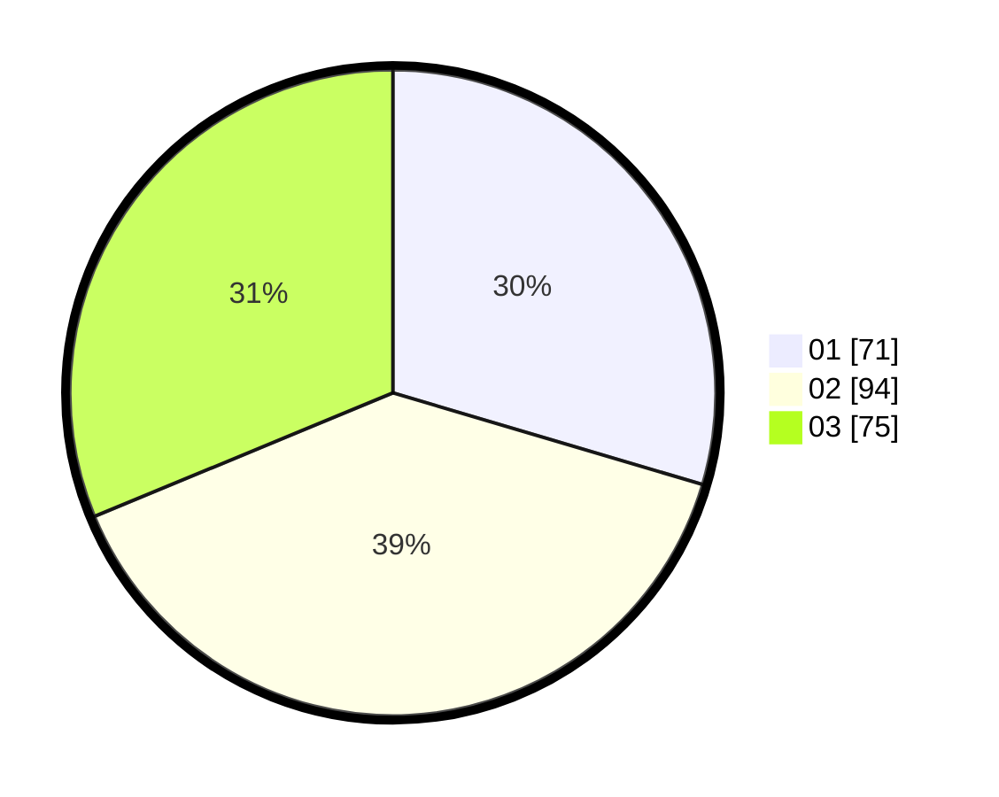

# Hasil

Hasil perolehan suara paslon dapat dilihat pada file paslon-01.txt, paslon-02.txt, dan paslon-03.txt.

Jika tidak ada, artinya data tersebut belum ada pada SIREKAP.

## Perolehan Suara

 * Paslon 01: **71**.
 * Paslon 02: **94**.
 * Paslon 03: **75**.

## Foto C Plano

https://sirekap-obj-formc.kpu.go.id/3177/pemilu/ppwp/31/75/02/10/06/3175021006073-20240215-024100--f7c4bb43-c213-4236-bbb9-704e7a6cebf5.jpg

https://sirekap-obj-formc.kpu.go.id/3177/pemilu/ppwp/31/75/02/10/06/3175021006073-20240215-024115--6b550c5e-0268-41c7-a381-7acaebb1e134.jpg

https://sirekap-obj-formc.kpu.go.id/3177/pemilu/ppwp/31/75/02/10/06/3175021006073-20240215-024135--83a1ce3c-5b24-4b43-b879-562d1d9cb26b.jpg

## DATA PEMILIH TETAP

Jumlah pemilih dalam DPT: **379**.
 * L: **170**.
 * P: **242**.

## DATA PENGGUNA HAK PILIH

Jumlah pengguna hak pilih dalam DPT: **230**.
 * L: **105**.
 * P: **124**.

Jumlah pengguna hak pilih dalam DPTb: **88**.
 * L: **4**.
 * P: **4**.

Jumlah pengguna hak pilih dalam DPK: **5**.
 * L: **2**.
 * P: **84**.

Jumlah pengguna hak pilih: **244**.
 * L: **747**.
 * P: **132**.

## JUMLAH SUARA SAH DAN TIDAK SAH

JUMLAH SELURUH SUARA SAH: **240**.

JUMLAH SUARA TIDAK SAH: **2**.

JUMLAH SELURUH SUARA SAH DAN SUARA TIDAK SAH: **242**.
