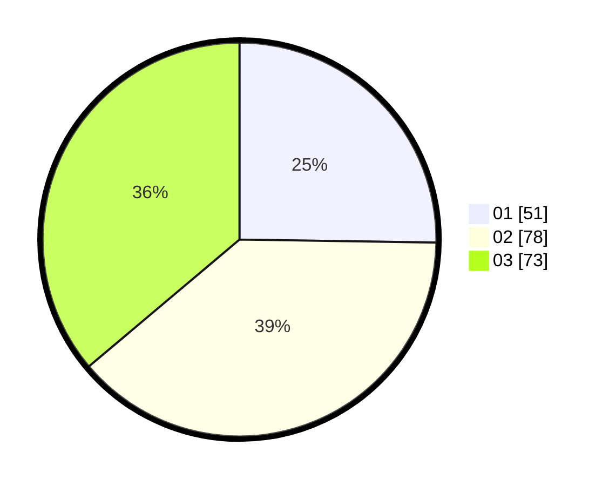

# Hasil

Hasil perolehan suara paslon dapat dilihat pada file paslon-01.txt, paslon-02.txt, dan paslon-03.txt.

Jika tidak ada, artinya data tersebut belum ada pada SIREKAP.

## Perolehan Suara

 * Paslon 01: **51**.
 * Paslon 02: **78**.
 * Paslon 03: **73**.

## Foto C Plano

https://sirekap-obj-formc.kpu.go.id/66e7/pemilu/ppwp/31/75/02/10/06/3175021006077-20240214-190540--929ab7a5-f55c-4f0a-a163-62c5af99ef39.jpg

https://sirekap-obj-formc.kpu.go.id/66e7/pemilu/ppwp/31/75/02/10/06/3175021006077-20240214-190545--16dbcfe6-c511-4d35-ad75-5dd1b8bc5e5e.jpg

https://sirekap-obj-formc.kpu.go.id/66e7/pemilu/ppwp/31/75/02/10/06/3175021006077-20240214-190550--4187b788-e5e7-4a3a-88bd-c7d28a056474.jpg

## DATA PEMILIH TETAP

Jumlah pemilih dalam DPT: **281**.
 * L: **131**.
 * P: **150**.

## DATA PENGGUNA HAK PILIH

Jumlah pengguna hak pilih dalam DPT: **199**.
 * L: **92**.
 * P: **107**.

Jumlah pengguna hak pilih dalam DPTb: **4**.
 * L: **4**.
 * P: **0**.

Jumlah pengguna hak pilih dalam DPK: **3**.
 * L: **1**.
 * P: **2**.

Jumlah pengguna hak pilih: **206**.
 * L: **97**.
 * P: **109**.

## JUMLAH SUARA SAH DAN TIDAK SAH

JUMLAH SELURUH SUARA SAH: **202**.

JUMLAH SUARA TIDAK SAH: **4**.

JUMLAH SELURUH SUARA SAH DAN SUARA TIDAK SAH: **206**.
