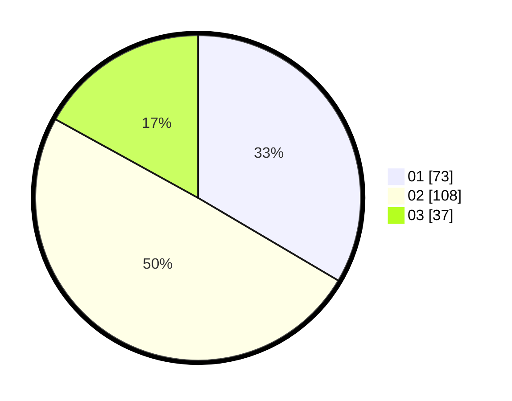

# Hasil

Hasil perolehan suara paslon dapat dilihat pada file paslon-01.txt, paslon-02.txt, dan paslon-03.txt.

Jika tidak ada, artinya data tersebut belum ada pada SIREKAP.

## Perolehan Suara

 * Paslon 01: **73**.
 * Paslon 02: **108**.
 * Paslon 03: **37**.

## Foto C Plano

https://sirekap-obj-formc.kpu.go.id/d509/pemilu/ppwp/31/75/02/10/06/3175021006084-20240218-095536--203774de-4ed5-4611-9ca6-5a5088d9b41d.jpg

https://sirekap-obj-formc.kpu.go.id/d509/pemilu/ppwp/31/75/02/10/06/3175021006084-20240214-211904--ca64bfcc-dc0f-426e-a587-7d89e675f9b7.jpg

https://sirekap-obj-formc.kpu.go.id/d509/pemilu/ppwp/31/75/02/10/06/3175021006084-20240218-095536--5331d983-734b-40d4-aff0-782af11a8606.jpg

## DATA PEMILIH TETAP

Jumlah pemilih dalam DPT: **276**.
 * L: **132**.
 * P: **144**.

## DATA PENGGUNA HAK PILIH

Jumlah pengguna hak pilih dalam DPT: **212**.
 * L: **99**.
 * P: **113**.

Jumlah pengguna hak pilih dalam DPTb: **6**.
 * L: **1**.
 * P: **5**.

Jumlah pengguna hak pilih dalam DPK: **4**.
 * L: **2**.
 * P: **2**.

Jumlah pengguna hak pilih: **222**.
 * L: **102**.
 * P: **120**.

## JUMLAH SUARA SAH DAN TIDAK SAH

JUMLAH SELURUH SUARA SAH: **218**.

JUMLAH SUARA TIDAK SAH: **4**.

JUMLAH SELURUH SUARA SAH DAN SUARA TIDAK SAH: **222**.
