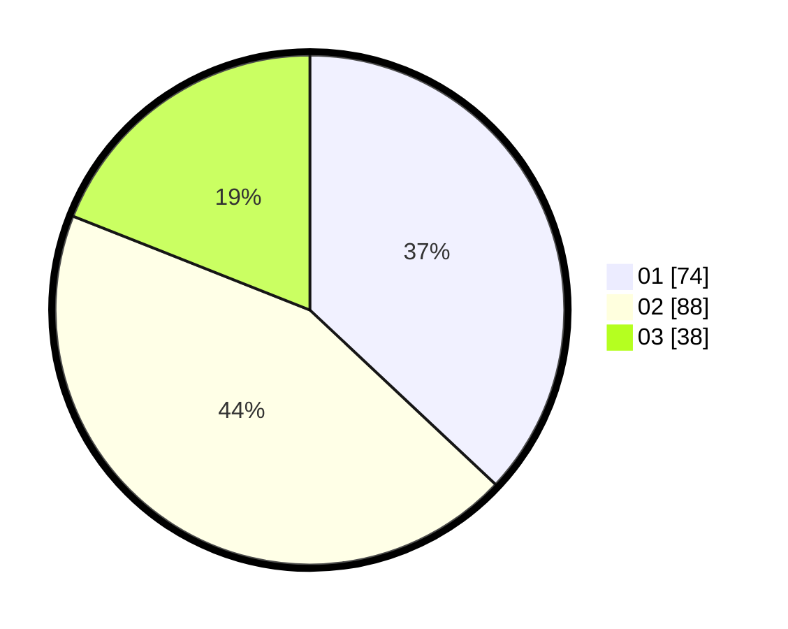

# Hasil

Hasil perolehan suara paslon dapat dilihat pada file paslon-01.txt, paslon-02.txt, dan paslon-03.txt.

Jika tidak ada, artinya data tersebut belum ada pada SIREKAP.

## Perolehan Suara

 * Paslon 01: **74**.
 * Paslon 02: **88**.
 * Paslon 03: **38**.

## Foto C Plano

https://sirekap-obj-formc.kpu.go.id/f623/pemilu/ppwp/31/75/02/10/06/3175021006085-20240214-190839--0463ba35-ae80-4c88-b58f-75c2cbdffc2c.jpg

https://sirekap-obj-formc.kpu.go.id/f623/pemilu/ppwp/31/75/02/10/06/3175021006085-20240214-155711--f7d0f639-a1de-493e-bca3-8b1bc5447489.jpg

https://sirekap-obj-formc.kpu.go.id/f623/pemilu/ppwp/31/75/02/10/06/3175021006085-20240216-021432--90daf57d-e725-4a6b-ad63-076061b9ff80.jpg

## DATA PEMILIH TETAP

Jumlah pemilih dalam DPT: **276**.
 * L: **136**.
 * P: **140**.

## DATA PENGGUNA HAK PILIH

Jumlah pengguna hak pilih dalam DPT: **197**.
 * L: **87**.
 * P: **110**.

Jumlah pengguna hak pilih dalam DPTb: **7**.
 * L: **2**.
 * P: **5**.

Jumlah pengguna hak pilih dalam DPK: **3**.
 * L: **1**.
 * P: **2**.

Jumlah pengguna hak pilih: **207**.
 * L: **90**.
 * P: **117**.

## JUMLAH SUARA SAH DAN TIDAK SAH

JUMLAH SELURUH SUARA SAH: **200**.

JUMLAH SUARA TIDAK SAH: **7**.

JUMLAH SELURUH SUARA SAH DAN SUARA TIDAK SAH: **207**.
