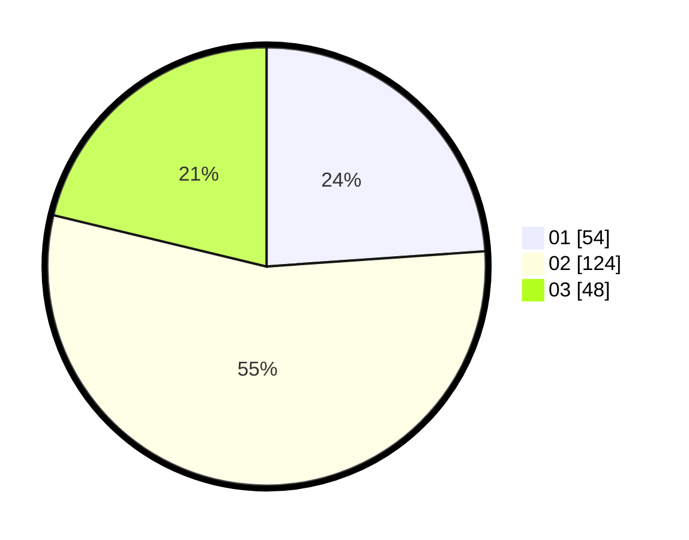

# Hasil

Hasil perolehan suara paslon dapat dilihat pada file paslon-01.txt, paslon-02.txt, dan paslon-03.txt.

Jika tidak ada, artinya data tersebut belum ada pada SIREKAP.

## Perolehan Suara

 * Paslon 01: **54**.
 * Paslon 02: **124**.
 * Paslon 03: **48**.

## Foto C Plano

https://sirekap-obj-formc.kpu.go.id/3f8e/pemilu/ppwp/31/75/02/10/06/3175021006088-20240215-021941--bdd691d7-1ac4-4a9e-9bb9-96a660bf2654.jpg

https://sirekap-obj-formc.kpu.go.id/3f8e/pemilu/ppwp/31/75/02/10/06/3175021006088-20240215-022019--bf7ebbb1-ce0d-43e7-b89e-6a43ffc4cff6.jpg

https://sirekap-obj-formc.kpu.go.id/3f8e/pemilu/ppwp/31/75/02/10/06/3175021006088-20240215-022110--a858372d-0433-48bb-90e0-ef19c4fc3bc5.jpg
