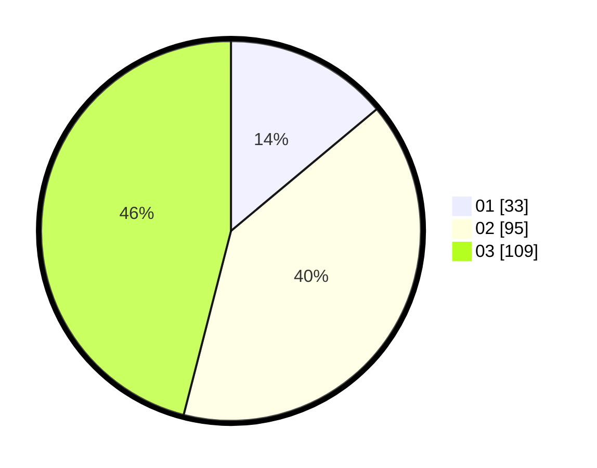

# Hasil

Hasil perolehan suara paslon dapat dilihat pada file paslon-01.txt, paslon-02.txt, dan paslon-03.txt.

Jika tidak ada, artinya data tersebut belum ada pada SIREKAP.

## Perolehan Suara

 * Paslon 01: **33**.
 * Paslon 02: **95**.
 * Paslon 03: **109**.

## Foto C Plano

https://sirekap-obj-formc.kpu.go.id/6210/pemilu/ppwp/31/75/02/10/06/3175021006094-20240214-185252--b2401845-b162-4539-943f-bc495a741bb9.jpg

https://sirekap-obj-formc.kpu.go.id/6210/pemilu/ppwp/31/75/02/10/06/3175021006094-20240214-185258--ac7d6a4f-9355-498c-a254-adbbe1d6591b.jpg

https://sirekap-obj-formc.kpu.go.id/6210/pemilu/ppwp/31/75/02/10/06/3175021006094-20240214-185303--724dac5f-615a-4863-a3ae-f15ad307aff2.jpg

## DATA PEMILIH TETAP

Jumlah pemilih dalam DPT: **280**.
 * L: **122**.
 * P: **158**.

## DATA PENGGUNA HAK PILIH

Jumlah pengguna hak pilih dalam DPT: **229**.
 * L: **95**.
 * P: **134**.

Jumlah pengguna hak pilih dalam DPTb: **6**.
 * L: **2**.
 * P: **4**.

Jumlah pengguna hak pilih dalam DPK: **3**.
 * L: **3**.
 * P: **0**.

Jumlah pengguna hak pilih: **238**.
 * L: **100**.
 * P: **138**.

## JUMLAH SUARA SAH DAN TIDAK SAH

JUMLAH SELURUH SUARA SAH: **237**.

JUMLAH SUARA TIDAK SAH: **1**.

JUMLAH SELURUH SUARA SAH DAN SUARA TIDAK SAH: **238**.
