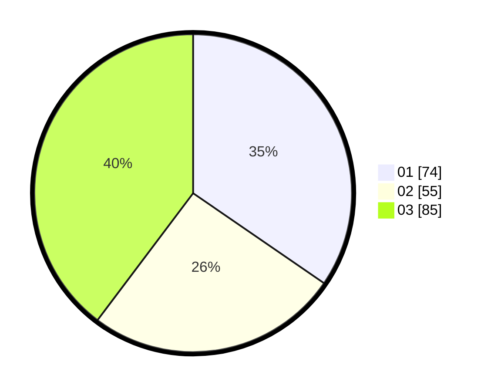

# Hasil

Hasil perolehan suara paslon dapat dilihat pada file paslon-01.txt, paslon-02.txt, dan paslon-03.txt.

Jika tidak ada, artinya data tersebut belum ada pada SIREKAP.

## Perolehan Suara

 * Paslon 01: **74**.
 * Paslon 02: **55**.
 * Paslon 03: **85**.

## Foto C Plano

https://sirekap-obj-formc.kpu.go.id/8eba/pemilu/ppwp/31/75/02/10/06/3175021006102-20240214-202453--b5882147-7ef1-41cc-9aea-4db5c3cfb7fe.jpg

https://sirekap-obj-formc.kpu.go.id/8eba/pemilu/ppwp/31/75/02/10/06/3175021006102-20240214-202448--1dbfeb85-5a53-4d30-9366-1f6617fb781d.jpg

https://sirekap-obj-formc.kpu.go.id/8eba/pemilu/ppwp/31/75/02/10/06/3175021006102-20240214-202443--bf1bcf18-43ea-4402-a94e-990f46224b12.jpg

## DATA PEMILIH TETAP

Jumlah pemilih dalam DPT: **272**.
 * L: **132**.
 * P: **140**.

## DATA PENGGUNA HAK PILIH

Jumlah pengguna hak pilih dalam DPT: **204**.
 * L: **110**.
 * P: **94**.

Jumlah pengguna hak pilih dalam DPTb: **18**.
 * L: **3**.
 * P: **15**.

Jumlah pengguna hak pilih dalam DPK: **0**.
 * L: **0**.
 * P: **0**.

Jumlah pengguna hak pilih: **222**.
 * L: **113**.
 * P: **109**.

## JUMLAH SUARA SAH DAN TIDAK SAH

JUMLAH SELURUH SUARA SAH: **214**.

JUMLAH SUARA TIDAK SAH: **8**.

JUMLAH SELURUH SUARA SAH DAN SUARA TIDAK SAH: **222**.
