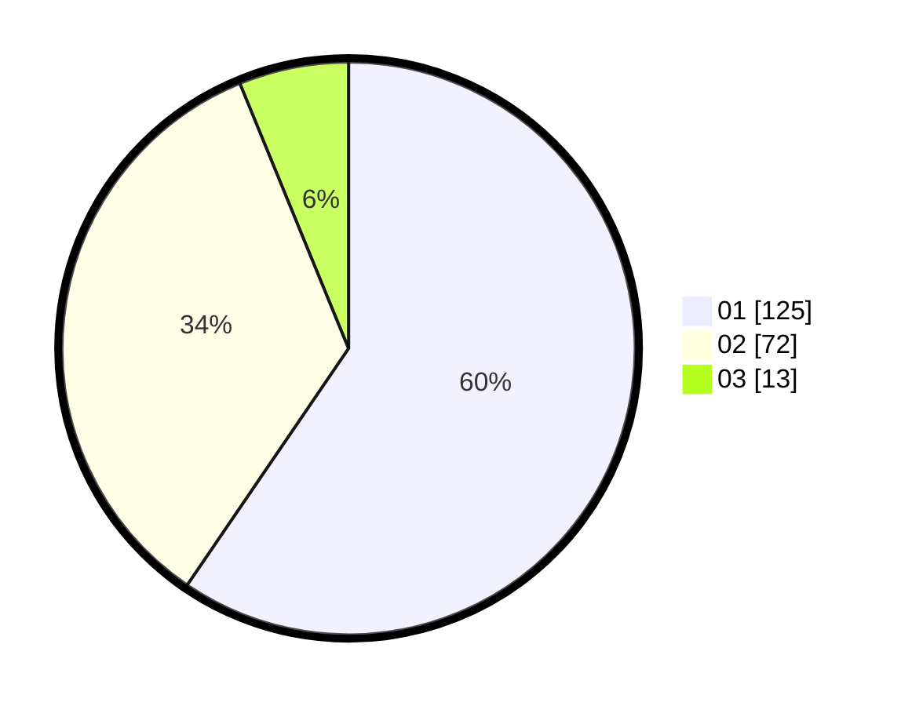

# Hasil

Hasil perolehan suara paslon dapat dilihat pada file paslon-01.txt, paslon-02.txt, dan paslon-03.txt.

Jika tidak ada, artinya data tersebut belum ada pada SIREKAP.

## Perolehan Suara

 * Paslon 01: **125**.
 * Paslon 02: **72**.
 * Paslon 03: **13**.

## Foto C Plano

https://sirekap-obj-formc.kpu.go.id/b80b/pemilu/ppwp/31/75/02/10/06/3175021006107-20240214-200743--25717b37-7c9a-4bba-b7ec-df1f3c1aea75.jpg

https://sirekap-obj-formc.kpu.go.id/b80b/pemilu/ppwp/31/75/02/10/06/3175021006107-20240214-200914--a65311f2-765f-4c5d-bab7-2354ff69a4ca.jpg

https://sirekap-obj-formc.kpu.go.id/b80b/pemilu/ppwp/31/75/02/10/06/3175021006107-20240214-201033--6a7f3ebd-22e5-4a34-90ca-c07c2e76f914.jpg
