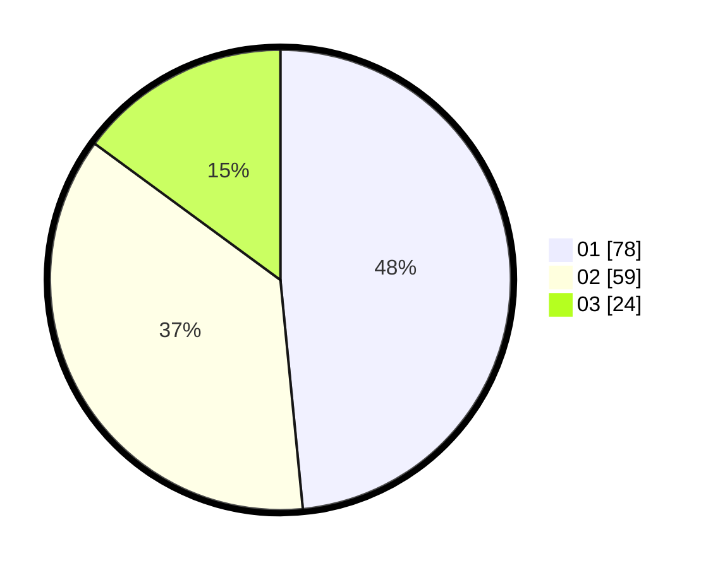

# Hasil

Hasil perolehan suara paslon dapat dilihat pada file paslon-01.txt, paslon-02.txt, dan paslon-03.txt.

Jika tidak ada, artinya data tersebut belum ada pada SIREKAP.

## Perolehan Suara

 * Paslon 01: **78**.
 * Paslon 02: **59**.
 * Paslon 03: **24**.

## Foto C Plano

https://sirekap-obj-formc.kpu.go.id/ab8c/pemilu/ppwp/31/75/02/10/06/3175021006116-20240214-233004--19fa94d2-ab33-43b8-ade3-032f1cba3d8c.jpg

https://sirekap-obj-formc.kpu.go.id/ab8c/pemilu/ppwp/31/75/02/10/06/3175021006116-20240214-200015--9f6b41a4-7d6d-4cb7-84bd-77ee2be5cb8d.jpg

https://sirekap-obj-formc.kpu.go.id/ab8c/pemilu/ppwp/31/75/02/10/06/3175021006116-20240214-195752--fc1e96aa-ca2e-4a0c-9434-115247f61469.jpg
