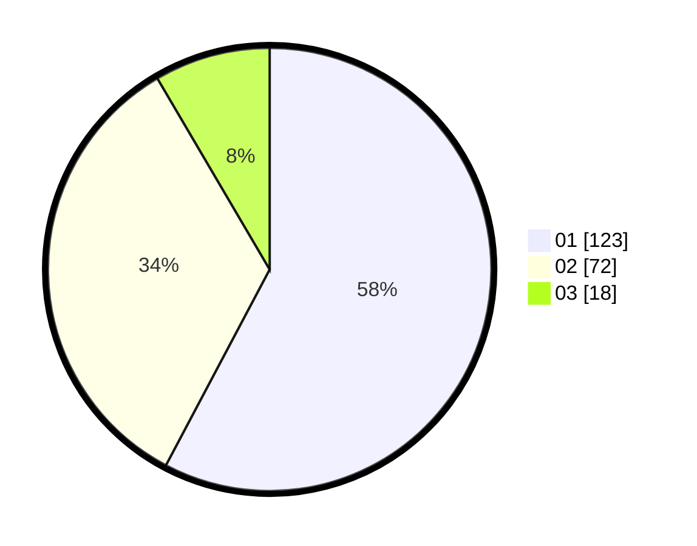

# Hasil

Hasil perolehan suara paslon dapat dilihat pada file paslon-01.txt, paslon-02.txt, dan paslon-03.txt.

Jika tidak ada, artinya data tersebut belum ada pada SIREKAP.

## Perolehan Suara

 * Paslon 01: **123**.
 * Paslon 02: **72**.
 * Paslon 03: **18**.

## Foto C Plano

https://sirekap-obj-formc.kpu.go.id/80d3/pemilu/ppwp/31/75/02/10/06/3175021006126-20240214-200125--9ac6162e-9cb2-4c58-9335-4d9357cc4dca.jpg

https://sirekap-obj-formc.kpu.go.id/80d3/pemilu/ppwp/31/75/02/10/06/3175021006126-20240214-200216--5f2b10f3-2890-46a1-b1a8-42a54252b055.jpg

https://sirekap-obj-formc.kpu.go.id/80d3/pemilu/ppwp/31/75/02/10/06/3175021006126-20240214-200337--9e444eab-0f77-4d64-98f8-1f3c935b7ecc.jpg

## DATA PEMILIH TETAP

Jumlah pemilih dalam DPT: **291**.
 * L: **145**.
 * P: **146**.

## DATA PENGGUNA HAK PILIH

Jumlah pengguna hak pilih dalam DPT: **207**.
 * L: **93**.
 * P: **114**.

Jumlah pengguna hak pilih dalam DPTb: **1**.
 * L: **0**.
 * P: **1**.

Jumlah pengguna hak pilih dalam DPK: **6**.
 * L: **3**.
 * P: **3**.

Jumlah pengguna hak pilih: **214**.
 * L: **96**.
 * P: **118**.

## JUMLAH SUARA SAH DAN TIDAK SAH

JUMLAH SELURUH SUARA SAH: **213**.

JUMLAH SUARA TIDAK SAH: **1**.

JUMLAH SELURUH SUARA SAH DAN SUARA TIDAK SAH: **214**.
