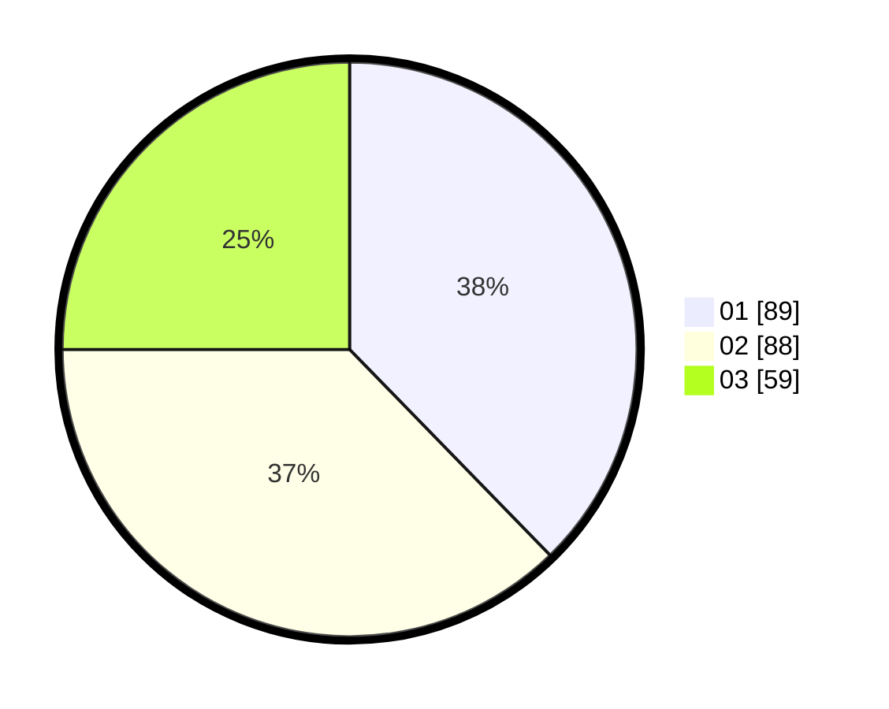

# Hasil

Hasil perolehan suara paslon dapat dilihat pada file paslon-01.txt, paslon-02.txt, dan paslon-03.txt.

Jika tidak ada, artinya data tersebut belum ada pada SIREKAP.

## Perolehan Suara

 * Paslon 01: **89**.
 * Paslon 02: **88**.
 * Paslon 03: **59**.

## Foto C Plano

https://sirekap-obj-formc.kpu.go.id/1d36/pemilu/ppwp/31/75/02/10/06/3175021006135-20240214-223602--a4983594-13fe-40ea-b3e4-76af3dccfa3c.jpg

https://sirekap-obj-formc.kpu.go.id/1d36/pemilu/ppwp/31/75/02/10/06/3175021006135-20240214-223712--83fc3712-d2bf-47d5-a460-22e8f006ed46.jpg

https://sirekap-obj-formc.kpu.go.id/1d36/pemilu/ppwp/31/75/02/10/06/3175021006135-20240214-223805--27e10707-89a6-48df-9a61-40e40251db75.jpg
