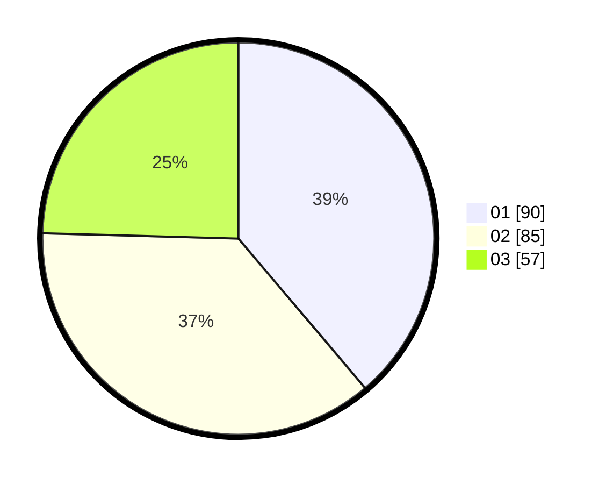

# Hasil

Hasil perolehan suara paslon dapat dilihat pada file paslon-01.txt, paslon-02.txt, dan paslon-03.txt.

Jika tidak ada, artinya data tersebut belum ada pada SIREKAP.

## Perolehan Suara

 * Paslon 01: **90**.
 * Paslon 02: **85**.
 * Paslon 03: **57**.

## Foto C Plano

https://sirekap-obj-formc.kpu.go.id/c6d2/pemilu/ppwp/31/75/02/10/07/3175021007008-20240214-201151--22c6b813-fec9-4b2c-bf4c-e4a28018affb.jpg

https://sirekap-obj-formc.kpu.go.id/c6d2/pemilu/ppwp/31/75/02/10/07/3175021007008-20240214-201455--f9fec01f-ac3c-4d60-a3d3-2bd165ee396b.jpg

https://sirekap-obj-formc.kpu.go.id/c6d2/pemilu/ppwp/31/75/02/10/07/3175021007008-20240214-201630--00027f87-0e08-4290-ba26-97501667f108.jpg

## DATA PEMILIH TETAP

Jumlah pemilih dalam DPT: **293**.
 * L: **133**.
 * P: **160**.

## DATA PENGGUNA HAK PILIH

Jumlah pengguna hak pilih dalam DPT: **232**.
 * L: **104**.
 * P: **128**.

Jumlah pengguna hak pilih dalam DPTb: **2**.
 * L: **1**.
 * P: **1**.

Jumlah pengguna hak pilih dalam DPK: **2**.
 * L: **2**.
 * P: **0**.

Jumlah pengguna hak pilih: **236**.
 * L: **107**.
 * P: **129**.

## JUMLAH SUARA SAH DAN TIDAK SAH

JUMLAH SELURUH SUARA SAH: **232**.

JUMLAH SUARA TIDAK SAH: **4**.

JUMLAH SELURUH SUARA SAH DAN SUARA TIDAK SAH: **236**.
