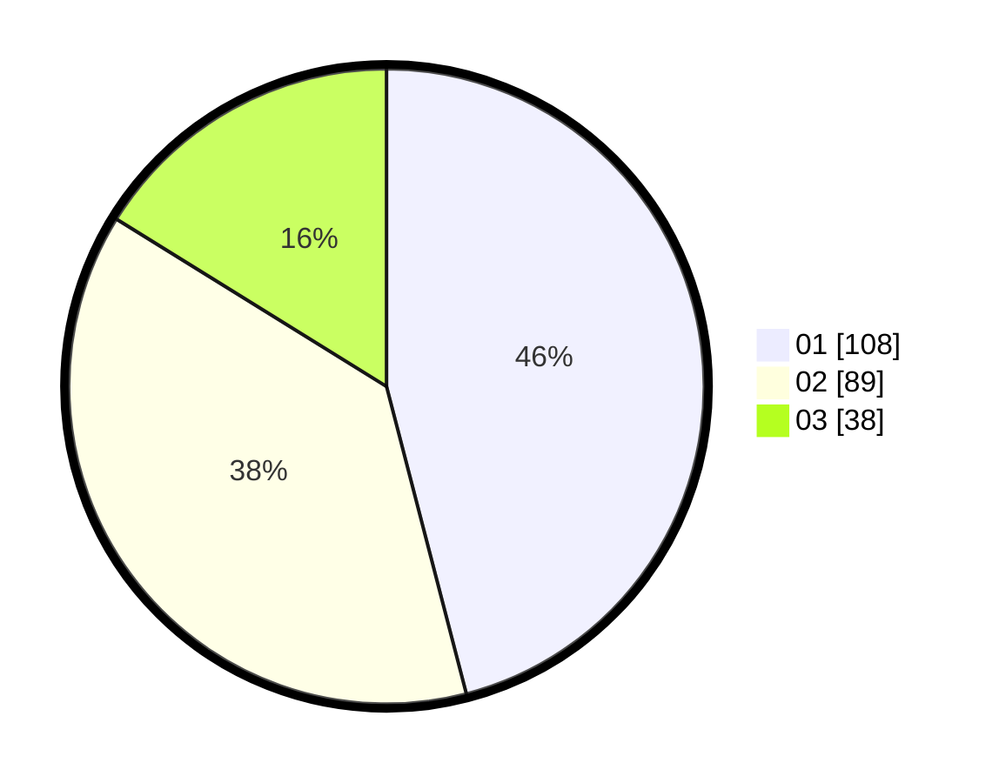

# Hasil

Hasil perolehan suara paslon dapat dilihat pada file paslon-01.txt, paslon-02.txt, dan paslon-03.txt.

Jika tidak ada, artinya data tersebut belum ada pada SIREKAP.

## Perolehan Suara

 * Paslon 01: **108**.
 * Paslon 02: **89**.
 * Paslon 03: **38**.

## Foto C Plano

https://sirekap-obj-formc.kpu.go.id/4e8c/pemilu/ppwp/31/75/02/10/07/3175021007035-20240215-133807--e7cb8a80-bd2d-48f0-962b-f70ea9d94a8e.jpg

https://sirekap-obj-formc.kpu.go.id/4e8c/pemilu/ppwp/31/75/02/10/07/3175021007035-20240215-133831--1e6eb2b0-abf0-4a38-bc16-708df48d0012.jpg

https://sirekap-obj-formc.kpu.go.id/4e8c/pemilu/ppwp/31/75/02/10/07/3175021007035-20240215-133821--dc482084-e980-4ef8-9339-dac6d2a04a2e.jpg

## DATA PEMILIH TETAP

Jumlah pemilih dalam DPT: **284**.
 * L: **142**.
 * P: **142**.

## DATA PENGGUNA HAK PILIH

Jumlah pengguna hak pilih dalam DPT: **226**.
 * L: **106**.
 * P: **120**.

Jumlah pengguna hak pilih dalam DPTb: **8**.
 * L: **5**.
 * P: **3**.

Jumlah pengguna hak pilih dalam DPK: **5**.
 * L: **1**.
 * P: **4**.

Jumlah pengguna hak pilih: **239**.
 * L: **112**.
 * P: **127**.

## JUMLAH SUARA SAH DAN TIDAK SAH

JUMLAH SELURUH SUARA SAH: **235**.

JUMLAH SUARA TIDAK SAH: **4**.

JUMLAH SELURUH SUARA SAH DAN SUARA TIDAK SAH: **239**.
